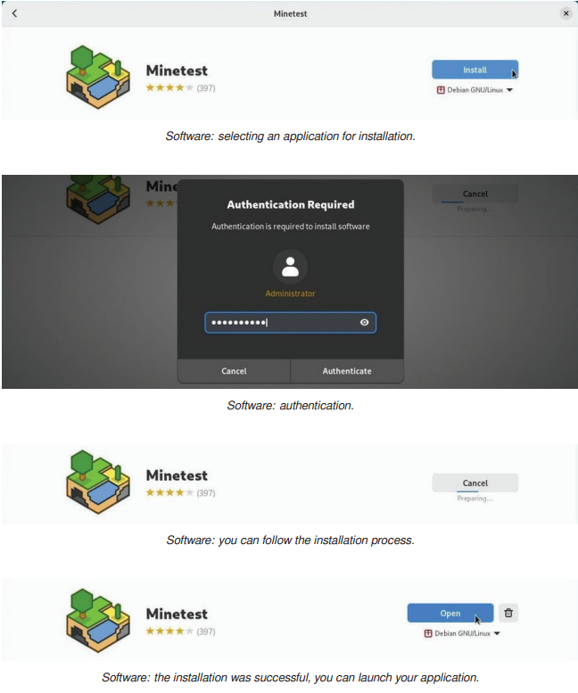
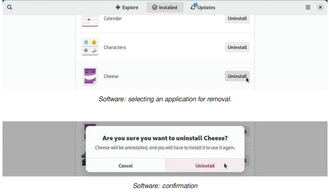

# LAPORAN WORKSHOP ADMINISTRASI JARINGAN

##### Anggota Kelompok 5:
##### Arsyita Devanaya Arianto (3122500008)
##### Mirta Chadhirotin Nachlah (3122500009)
##### Shofira Izza Nurrohmah (3122500026)

 

## Politeknik Elektronika Negeri Surabaya
## Program Studi Teknik Informatika
## 2024

---
## 8.1 The software sources
Debian GNU/Linux menggunakan metodologi repositori untuk mendistribusikan/ menyediakan aplikasi. Metodologi ini dapat dengan mudah mengatur dan meningkatkan sistem tanpa harus mengunjungi situs software (perangkat lunak) secara langsung.

### 1. The sources.list file
Alamat Internet repositori Debian disimpan di dalam file /etc/apt/sources.list, serta file bertipe /etc/apt/sources.list.d/xxx.list.
Untuk mengedit dan memodifikasi file source.list, gunakan salah satu perintah berikut (mode administrator):
~~~ 
apt edit-sources 
~~~
~~~ 
nano /etc/apt/sources.list
~~~

---
File sources.list berisi informasi tentang repositori yang digunakan oleh sistem Debian GNU/Linux. Setiap baris dalam file ini memberikan detail seperti berikut:
- Baris yang diawali dengan "#" hanyalah komentar
- "deb": artinya repositori biner, yang berisi perangkat lunak yang telah dikompilasi.
- "deb-src": artinya repositori sumber, yang berisi file kode program untuk mengkompilasi perangkat lunak.
- "http:..." atau "https:...": Alamat Internet dari server repositori, yang menunjukkan tempat di mana sistem akan mengambil paket perangkat lunak.
- "bookworm" atau "bookworm-security": berarti cabang di pohon repositori, menunjukkan versi atau tingkat keamanan dari repositori tersebut.
- "main" atau "non-free-firmware": bagian repositori yang berisi berbagai jenis perangkat lunak, seperti perangkat lunak inti (main) atau yang tidak gratis (non-free-firmware).

"Bookworm" adalah versi spesifik dari sistem Debian yang diinstal dalam menentukan versi dari setiap paket yang termasuk dalam repositori "bookworm", seperti versi kernel generik. "Stable" adalah istilah umum yang digunakan untuk merujuk pada versi yang stabil saat ini yaitu Debian 12 "bookworm". Namun, jika versi Debian "stable" berubah menjadi Debian 13 "Trixie", maka Debian 12 "bookworm" akan menjadi "oldstable".

---
### 2. About repositories, branches and sections/components

Debian mengatur paket perangkat lunaknya di dalam repositori yang terbagi menjadi 4 bagian utama:
- main (utama): dikompilasi ke DFSG tanpa dependensi "non-free".
- non-free-firmware: non-free-firmware disertakan secara default sejak Debian 12
- contrib: dikompilasi ke DFSG dengan beberapa dependensi "non-free".
- non-free: tidak mematuhi DFSG (Debian Free Software Guidelines) yang merupakan panduan perangkat lunak gratis Debian 

Hanya paket dalam bagian utama yang secara resmi didukung oleh Debian dan merupakan perangkat lunak gratis. Sebaliknya, firmware dalam contrib, non-free dan non-free-firmware mungkin tidak gratis. Bergantung pada jenis hardware, mungkin beberapa layanan tidak berfungsi dengan benar tanpa menggunakan driver berpemilik. Sehingga diperlukan modifikasi file /etc/apt/sources.list untuk mengakses repositori yang sesuai.

---
### 3. Backport packages

Backports merupakan repositori khusus dalam Debian yang menyediakan versi terbaru dari beberapa aplikasi. Repositori ini tidak diaktifkan secara default, tetapi tidak menimbulkan risiko bagi sistem. Repositori reguler memiliki prioritas tertinggi selama proses pembaruan, hanya aplikasi yang diinstal dari backports yang melihat ke dalam repositori ini.

Backport tidak ada hubungannya dengan "backdoors" yang digunakan untuk memata-matai komputer yang menjalankan sistem berpemilik. Backport memungkinkan aplikasi yang saat ini disimpan di repositori pengembangan Debian, untuk dipindahkan kembali ke versi "stabil". Misalnya, mengambil versi terbaru dari repositori pengembangan LibreOffice, dan kompilasi ulang (re-build) paket yang menyimpan aplikasi, sambil menjaga semua dependensi yang ada di versi "stabil".

---
### 4. Modifying the Repositories

Sebelum memodifikasi sumber perangkat lunak pada sistem, ada beberapa risiko yang perlu dipertimbangkan dengan menggunakan komponen "contrib" atau "non-free" dari cabang yang diarsipkan:
- Kurangnya kebebasan untuk komponen "contrib" atau "non-free"
- Kurangnya dukungan dari proyek Debian karena tidak tersedia source code untuk pemeliharaan
- Kontaminasi sistem Debian yang sebelumnya sepenuhnya gratis.

Untuk memodifikasi sumber perangkat lunak, dapat mengedit file 'sources.list' melalui terminal dalam mode administrator dengan menggunakan perintah `apt edit-sources`.
Perintah ini membuka file yang sesuai dengan editor teks default (nano atau vim). Setelah selesai dengan modifikasi, menyimpan file dan memilih dari 4 bagian paket serta menginstal codec dan driver non-free.

---
## 8.2 APT in a terminal
Perintah dasar untuk mengelola paket Debian dengan APT (Advanced Package Tool) dalam terminal. APT adalah alat manajemen paket yang kuat dalam Debian. Sebagai manajer paket lain, Debian juga mendukung "aptitude", dengan sintaks dan perilaku berbeda dan panduan ini ditujukan untuk pemula. 

### 1. ‘User’ command to search and display information
Berikut adalah perintah yang dapat dijalankan oleh pengguna sederhana
|  Perintah | Deskripsi|
|---------- |----------|
| apt show foo | Menampilkan informasi tentang paketfoo | 
| apt search foo | Mencari paket yang sesuai dengan foo |
| apt-cache policy foo | Tampilkan versi foo yang tersedia |

### 2. ‘Administrator’ mode commands for system maintenance

Perintah-perintah ini harus dijalankan dengan hak administrator "root". Untuk berpindah ke mode administrator di terminal, ketik `su-` kemudian permintaan kata sandi administrator.

---
|  Perintah | Deskripsi|
|----------|----------|
| apt update | Memperbarui metadata repositori | 
| apt install foo | Instal paket foo dan dependensinya |
| apt upgrade | Pembaruan keamanan dari paket yang diinstal |
| apt full-upgrade | Pembaruan paket yang diinstal, dengan menambah/menghapus paket lainnya jika perlu |
| apt remove foo | Menghapus paket foo, tetapi bukan file konfigurasi |
| apt autoremove | Menghapus otomatis paket yang tidak perlu |
| apt purge foo | Membersihkan paket foo dan file konfigurasinya |
| apt clean | Membersihkan cache lokal dari paket yang diinstal |
| apt autoclean | Membersihkan cache lokal dari paket-paket usang |
| apt-mark showmanual | Menampilkan paket yang diinstal secara manual" |

Perintah mode administrator:
- Untuk memperbarui informasi repositori, memperbarui sistem, membersihkan cache paket:
`apt update && apt full-upgrade && apt autoclean`
- Untuk menghapus paket yang tidak berguna, dependensi yang tidak diperlukan, dan file konfigurasi lama:
`apt autoremove --purge`

---
## 8.3 Software: the simplified package manager
Perangkat Lunak (software) adalah manajer yang disederhanakan untuk aplikasi Debian. Digunakan untuk mencari, menginstal, menghapus atau memperbarui paket yang berisi aplikasi. Aplikasi ini dapat diakses melalui kategori "System" pada menu atau langsung melalui kotak pencarian Gnome dengan mengetik "Software".

### 1. Software: searching an application
Dengan mengklik tombol pencarian (simbol kaca pembesar) atau memilih salah satu kategori yang tersedia:

---
### 2. Software: installing an application
Untuk menginstal aplikasi, klik bagian deskripsi, kemudian tombol "Install". Diperlukan kata sandi administrator untuk melakukan instalasi. Proses instalasi dipantau di jendela utama dan langsung meluncurkan aplikasi yang baru diunduh.

### 3. Software: removing an application
Buka kategori "Installed" kemudian klik tombol "Remove". Setelah itu akan dimintai konfirmasi untuk menghapus instalasi aplikasi.

---
### 4. Software: upgrading your applications
Pembaruan sistem dapat diakses pada bagian "Updates" untuk melihat pembaruan yang tersedia. Jika tidak ada pembaruan, maka dapat memeriksa repositori dengan menggunakan tombol khusus di kiri atas.
Contoh pembaruan termasuk "operating system update" memerlukan reboot setelah mengunduh paket. Setelah reboot, akan menerima pesan di desktop yang mengkonfirmasi instalasi berhasil.
 

### 5. Software: modify packages repositories
Aplikasi Software mengkonfigurasi repositori secara grafis. Buka menu, pilih "Repositories".Tambahkan source "non-free" dan atur frekuensi pembaruan. Informasi alamat repositori yang ditampilkan berasal dari file source.list. Setelah modifikasi, perlu memuat ulang paket informasi sesuai dengan pesan yang ditampilkan.

---
  

### 6. Automatic updates with Software
Buka menu "Software", pilih "Update Preference". Nyalakan tombol "Automatic Updates". Sehingga tidak perlu khawatir  untuk memperbarui sistem secara manual. 
 

---
## 8.4 Discover: the KDE package manager 
Gnome menggunakan Software untuk mengelola aplikasi secara sederhana, sedangkan KDE mengintegrasikan Discover (sebuah program yang intuitif dan efisien). Discover digunakan untuk mencari, menginstal, menghapus, atau memperbarui aplikasi dari satu antarmuka serta memodifikasi sumber software untuk menginstal - atau tidak - beberapa aplikasi yang tidak gratis.
Discover diluncurkan menu utama KDE > Aplikasi> Sistem > Pusat Perangkat Lunak

 

### 1. Search and install with Discover
Untuk menemukan sebuah aplikasi, ketikkan namanya di kolom pencarian atau kunjungi berbagai kategori Discover. Kemudian klik tombol "Install":
 

---

1.1 Instal Plasma dekstop widget and addons 
Discover untuk menambahkan komponen tambahan ke Plasma environment. Untuk mencapai hal ini, kunjungi bagian "Plasma add-ons". Dan beberapa modul tambahan yang tersedia untuk aplikasi.

 

---
### 2. Uninstalling an application with Discover
Buka kategori "Installed" lalu klik "Remove":

### 3. Discover: updating your applications
KDE memberitahu pengguna tentang satu atau lebih pembaruan melalui Discover. Untuk memeriksa pembaruan secara manual, klik tombol khusus. Kemudian klik "Update All" dan konfirmasi dengan kata sandi administrator. Pengelolaan perangkat lunak dapat dilihat prosesnya di area notifikasi KDE. Dan pesan notifikasi diterima di akhir proses.

---

### 4. Discover: managing repositories
Discover dapat mengubah sources aplikasi tanpa menggunakan terminal. Buka bagian "Pengaturan" dan temukan alamat repositori dari sources.list.

---
# 8.5 Synaptic: the comprehensive package manager

Synaptic adalah antarmuka grafis untuk manajer paket Debian yang memungkinkan pengguna melihat semua paket yang tersedia, baik yang sudah terinstal maupun belum. Ini menawarkan fungsionalitas yang sama dengan apt dan membutuhkan kata sandi administrator serta koneksi internet untuk digunakan.

---

### 1. Synaptic: Main interface

Synaptic adalah manajer paket grafis untuk sistem Debian. Ini memiliki 4 area: toolbar, panel seleksi paket, panel daftar paket, dan panel deskripsi. Status paket ditampilkan dengan warna. Perubahan tidak berlaku tanpa menekan "Terapkan". Penting untuk memuat ulang "Reload" untuk memperbarui informasi.

---

### 2. Managing the repositories with Synaptic

Repositori memungkinkan untuk memperbarui dan menginstal paket tambahan, dapat dikelola kapan saja melalui Synaptic package manager.
1. Buka manajer paket Synaptic (menu Sistem » Manajer paket Synaptic).
2. Di bilah menu atas, klik pada "Settings", dan kemudian "Repositories".
3. Modifikasi sumber repositori dilakukan dengan mengklik pada sumber yang ada atau menambahkan sumber baru.
4. Setelah modifikasi, daftar repositori perlu dimuat ulang untuk mengakui perubahan. 
5. Untuk antarmuka yang disederhanakan dengan kotak centang pada salah satu desktop Xfce, LXDE, atau LXQt, instal paket "software-properties-gtk".

---

### 3. Updating the system with Synaptic

1. Muat ulang daftar paket  dengan pergi ke menu “Edit >> Reload Packages Information” ([ctrl]+r untuk shortcut keyboard)
2. Kemudian klik “Mark All Upgrade” atau pergi ke menu “Edit >> Mark All Upgrades…”.
3. Jika tidak ada yang terjadi setelah mencoba memperbarui, itu menandakan bahwa sistem sudah terbarui.
4. Jika ada paket yang dapat diperbarui, bisa dilihat di bagian “Status” section > “installed (upgradable)”
5. Jendela baru muncul dengan daftar paket yang akan ditingkatkan serta dependensi tambahan, jika diperlukan.
6. Klik  “Add to selection” lalu tombol “Apply”, dan terima konfirmasi yang diminta
7. Proses pembaruan sistem dimulai dengan mengunduh paket, dan dilanjutkan dengan instalasinya.
8. Pesan pemberitahuan bahwa semua perubahan telah diterapkan.

---

### 4. Searching for a software

Jika ingin mencari sesuatu secara spesifik, gunakan tombol pencarian. Jika tidak mengetahui nama paket yang dibutuhkan, gunakan penyaringan daftar berdasarkan bagian, status, atau asal untuk menemukan apa yang Anda butuhkan. Misalnya, jika ingin mencari game, dapat menemukannya di bagian "Permainan dan Hiburan".

---

### 5. Installing a package with Synaptic
1. Untuk instal satu atau beberapa package, klik kotak kecil kanan pada bagian depan nama package, dan pilih opsi “Mark for Installation”.
2. Jika sebuah paket memerlukan instalasi paket lain (dependensi), dependensi tersebut akan secara otomatis ditambahkan ke pilihan.
3. Klik tombol "Apply", dan konfirmasi ringkasan perubahan yang akan diterapkan.
4. Ikuti proses package di download hingga selesai 
5. Successful operation

   ### Reinstal a package

   Jika ingin menginstal ulang paket yang sudah terpasang, pilih opsi "Mark for Reinstal". Ini memungkinkan, misalnya, untuk mengembalikan konfigurasi default aplikasi yang telah dimodifikasi.
   

---

### 6. Uninstall a package with Synaptic
1. Klik kanan pada kotak kecil di depan nama paket, dan pilih opsi “Mark to Removal”. lalu klik “Apply”. 
2. Penghapusan sederhana menjaga file konfigurasi paket di sistem jika ingin menginstal ulang nanti. 
3. Lalu untuk menghapus juga file konfigurasi, pilih opsi "Mark for Complate Removal" (setara dengan "purge" dalam perintah baris terminal).

---

##### 6.1 Synaptic: cleaning useless package
Saat perangkat lunak dihapus, paket dependensi yang tidak lagi berguna dapat dihapus dengan Synaptic.
1. Klik "Status" pada panel kiri
2. Pilih "Installed (auto removable)"
3. Tandai paket yang tidak berguna
4. Klik “Mark for complate Removal”, dan klik "Terapkan".

---

##### 6.2 Removing configuration residues
Synaptic memungkinkan penghapusan sisa penghapusan konfigurasi dengan mudah.
1. Klik “status” di bagian bawah panel kiri
2. Pilih “not installed (residual config)”
3. Tandai paket
4. Pilih “Mark for complete Removal”
5. Lalu klik terapkan.

---

### 7. Look at detailed information on a package
Deskripsi paket dapat dilihat pada panel tengah bawah Synaptic dengan mengklik pada paket tersebut. Untuk informasi lebih lanjut, Anda dapat mengklik kanan pada paket dan memilih "Properties" atau pergi ke menu "Packages » Properties". Ini akan memberikan informasi lengkap tentang paket, termasuk dependensi, file yang terinstal, ukuran, dan versi.

---

### 8. Synaptic preference
Kategori "Preferences" dalam Synaptic menyediakan pengaturan untuk aplikasi tersebut. Ini termasuk pengaturan umum, tampilan kolom dan font, warna paket, pengelolaan file cache, koneksi jaringan, dan perilaku upgrade paket. Perlu berhati-hati saat mengubah pengaturan, dan untuk tindakan yang lebih cepat, pengguna juga dapat menggunakan terminal.

---

# 8.6 Cleaning the system
Meskipun hard disk memiliki kapasitas yang lebih besar, pembersihan disk tetap diperlukan. Beberapa skrip otomatis dapat membantu, tetapi akan lebih baik memeriksa sebelum menggunakan perintah "rm" (singkatan dari delete).

---

### 1. Disk space information
Hal pertama yang harus dilakukan adalah mengetahui ruang yang terpasang pada disk.
1. Ruang disk dalam mode terminal
2. Daftar repositori yang disimpan berdasarkan urutan ukuran besar ke kecil menggunakan perintah:
    ~~~
    "du -ms * | sort -nr"
    ~~~
3. NCDU untuk menganalisis ruang disk dalam metode konsol ketik "ncdu", gunakan perintah: 
   ~~~
   apt update && apt install ncdu
   ~~~
4. Baobab untuk menganalisis ruang disk dlm mode grafis dapat menggunakan perintah:
   ~~~
   apt update && apt install baobab
   ~~~

---

### 2. Cleaning the package
1. Bersihkan "apt cache" menggunakan perintah:
    ~~~
    apt clean
    ~~~
2. Paket yang tidak diperlukan dapat di hapus, namun periksa daftar paket yang akan dihapus lebih dahulu menggunakan perintah:
   ~~~
   apt autoremove --purge
   ~~~
3. Buat daftar dan menghapus paket lama menggunakan perintah: 
    ~~~
    apt list '?absoluter'
    apt remove '?absoluter'
    ~~~
4. Bersihkan file konfigurasi yang tersisa menggunakan perintah:
   ~~~
   dpkg --list | awk '/^rc/ {print $2}'
   apt purge $(dpkg --list | awk '/^rc/ {print $2}')
   ~~~
5. disarankan untuk menginstal alat deborphan yang dapat menampilkan daftar paket-paket yang tidak bergantung pada paket lain di sistem , berikut penginstalan deborphan dan jalankan:

---

### 3. Emptying the trash bins
Ada tiga keranjang sampah yang perlu dipertimbangkan:
1. Keranjang sampah pengguna: Terletak di ~/.local/share/Trash/. Anda bisa mengosongkannya melalui pengelola file sistem atau terminal dengan perintah:
    ~~~
    rm -Rf ~/.local/share/Trash/*
    ~~~
2. Keranjang sampah administrator: Terletak di /root/.local/share/Trash/. Anda perlu menggunakan terminal dalam mode administrator untuk mengosongkannya dengan benar:
   ~~~
   rm -Rf /root/.local/share/Trash/*
   ~~~
3. Keranjang sampah eksternal: Biasanya terletak di disk eksternal dengan alamat '/media/your_id/your_disk/.Trash_1000', dimana "your_id" adalah nama login Anda.

---

### 4. Purging application caches
Beberapa aplikasi menyimpan data di folder "cache" untuk meningkatkan performa. Jika ukurannya terlalu besar, Anda bisa menghapusnya dengan:
~~~
rm -Rf ~/.cache/*
~~~
Setiap aplikasi mengelola cache-nya dengan cara berbeda. Beberapa membersihkannya otomatis saat ditutup, beberapa menyimpan cache di /tmp yang terhapus saat logout, dan yang lain menyimpannya di folder khusus. Contohnya, untuk Firefox, Anda dapat membersihkan cache melalui menu preferensi dan mengotomatisasikan tindakan ini setiap kali aplikasi ditutup.

---
### 5. Purging the thumbnails
Setiap kali membuka folder dengan gambar atau video, thumbnail dibuat dan disimpan untuk digunakan kembali. Namun, ketika file grafis dihapus, thumbnail-nya tetap menyita ruang disk. Untuk membersihkannya:
~~~
rm -Rf ~/.thumbnails
~~~

Folder ini akan dibuat kembali saat diperlukan untuk menyimpan thumbnail yang baru.

----
# 8.7 Installaing external “.deb” package
Debian GNU/Linux menggunakan repositori paket untuk mengelola perangkat lunak dan meningkatkan keamanan sistem. Namun, terkadang diperlukan paket eksternal dalam format ".deb", yang berasal dari "Debian". Ini adalah format arsip terkompresi yang dapat ditangani oleh manajer paket Debian seperti APT dan Synaptic.

---

### 1. Installation in graphic mode with GDebi
GDebi adalah utilitas grafis untuk menginstal paket eksternal dalam format ".deb" dan mengelola dependensinya. Untuk installnya:
1. Cari "gdebi" di manajer favorit menggunakan perintah berikut:
   ~~~
   apt update && apt install gdebi
   ~~~
2. Klik kanan pada paket tersebut dan pilih "Open with gdebu"
3. Klik "Install Package"
4. Jika ingin uninstall klik "Remove Package"

---
### 2. Installation in terminal mode with Dpkg
Dpkg adalah utilitas untuk mengelola paket perangkat lunak tanpa mengelola dependensi seperti apt.
1. Untuk menginstal paket eksternal dengan dpkg, gunakan perintah: 
   ~~~
   dpkg -i package_name.deb
   ~~~
2. Jika ada pesan kesalahan terkait dependensi yang hilang, instal dependensi tersebut dengan apt menggunakan perintah : 
   ~~~
   apt install dependency_1 dependency_2
   ~~~
3. Untuk menghapus paket eksternal, gunakan perintah: 
   ~~~
   dpkg --purge package_name
   ~~~
4. Dpkg terintegrasi secara default di Debian dan harus digunakan dalam mode administratif.

---
# 8.8 Installing Flapak applications

Flatpak adalah sistem virtualisasi aplikasi untuk GNU/Linux yang menyediakan lingkungan "sandbox" terisolasi. Ini memungkinkan pengguna menjalankan aplikasi yang tidak divalidasi oleh repository distribusi, seperti versi uji coba atau terbaru, tanpa mengganggu stabilitas sistem.

### 1. Installing Flatpak
   Instal paket yang sesuai menggunakan perintah: 
   ~~~
   apt install flatpak
   ~~~

### 2. Add a Flatpak repository
   Untuk menambahkan repositori seperti Flathub dan mendapatkan keuntungan dari pencarian yang mudah dan instalasi yang disederhanakan, gunakan perintah:
   
   flatpak remote-add flathub https://flathub.org/repo/flathub.flatpakrepo
    

### 3. Manage Flatpak application under Gnome with software
   Setelah itu masukkan kata sandi administrator. Setelah proses selesai, restart sistem agar perubahan dapat diperhitungkan.

---
### 4. Manage Flatpak application under KDE with Discover
   Untuk mengelola Flatpak dalam Discover di KDE, instal plugin dengan perintah:
   
   apt install plasma-discover-backend-flatpack
    
   Setelah itu aplikasi Flatpack dapat diolah melalui Discover.Saat mencari, pastikan untuk mengklik file perangkat lunak. Jangan langsung klik "Instal" karena repositori Debian memiliki prioritas.
   
   Pilih repositori flathub dari menu Temukan "Sumber". Kemudian luncurkan instalasi dengan mengklik "Instal":
   
   Kemudian masukkan kata sandi administrator yang telah diminta.

---
### 5. Manage Flatpak application from your terminal
   
   Kasus khusus: instalasi Flatpak untuk pengguna saat ini hanya menggunakan opsi "--user". File-file akan ditempatkan di direktori pengguna ($HOME/.local/share/flatpak/).
   - Gunakan perintah berikut untuk menginstal aplikasi Flatpak:
    
    flatpack --user install repository flatpack_name
   
   - Contoh untuk menginstal LibreOffice dari Flathub:
   
    flatpak install flathub org.libreoffice.LibreOffice
   
   - Untuk meluncurkan LibreOffice versi Flatpak:
   
    flatpak run org.libreoffice.Libreoffice
   
---

### 6. Remove a Flatpak application
   Jika ingin menghapus Flatpak melalui antarmuka grafis seperti Perangkat Lunak atau Discover, cari Flatpak di menu aplikasi yang diinstal melalui manajer perangkat lunak Anda. Kemudian, mulai proses penghapusan melalui tombol khusus. Untuk menghapus semua dependensi (perangkat lunak lain yang diinstal untuk menjalankan Flatpak tersebut), gunakan perintah berikut di terminal:
   ~~~
   flatpak uninstall --unused
   ~~~

---

### 7. Some Flatpak repositories
   Berikut adalah beberapa repositori yang menggunakan format Flatpak dan perintah yang harus dijalankan untuk menambahkan repositorinya:
   - Repository Flathub:
     * URL: https://flathub.org/gathering
     * Perintah: 
        ~~~
        flatpak remote-add --if-not-exists flathub https://flathub.org/repo/flathub.flatpakrepo
        ~~~
   - Repositori Flatpak KDE Apps:
    * URL: https://distribute.kde.org/kdeapps.flatpakrepo
     * Perintah: 
        ~~~
        flatpak remote-add --if-not-exists kdeapps https://distribute.kde.org/kdeapps.flatpakrepo
        ~~~
   - Repositori Flatpak Gnome Nightly:
    * URL: https://nightly.gnome.org/gnome-nightly.flatpakrepo
     * Perintah: 
        ~~~
        flatpak remote-add --if-not-exists gnome-nightly https://nightly.gnome.org/gnome-nightly.flatpakrepo
        ~~~
  Dengan menjalankan perintah ini, Anda dapat menambahkan repositori Flatpak yang berbeda ke sistem Anda. Perintah menggunakan opsi "--if-not-exists" untuk menghindari kesalahan yang disebabkan oleh duplikat jika repositori sudah ada di sistem.

---
# 8.9 Who is the sid guy?
Debian memiliki beberapa cabang distribusi yang berjalan secara paralel, termasuk oldstable, stable, testing, dan unstable, serta eksperimental. 
1. Distribusi Stable adalah versi resmi Debian yang direkomendasikan, yang hanya menerima pembaruan keamanan dan perbaikan bug. 
2. Oldstable adalah versi stabil sebelumnya yang mungkin mendapat dukungan jangka panjang (LTS) tergantung pada kebutuhan pengguna. 
3. Testing adalah versi stabil berikutnya yang digunakan untuk menyiapkan rilis berikutnya. 
4. Unstable, disebut juga Sid, adalah versi pengembangan yang menerima semua pembaruan paket baru tetapi mungkin kurang stabil. 
5. Eksperimental adalah repositori tempat versi perangkat lunak alfa atau beta diuji. 
   
Setiap distribusi memiliki nama panggilan yang diambil dari karakter Toy Story. Saat ini, versi stabil adalah Bookworm, pengujiannya adalah Trixie, dan versi stabil lama adalah Bullseye, sedangkan eksperimental tidak memiliki nama panggilan.
