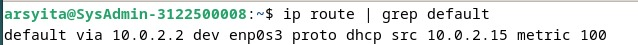
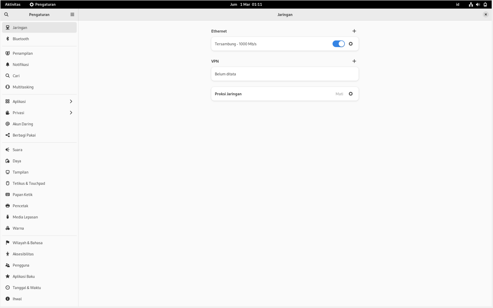
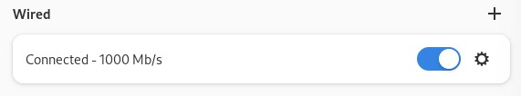
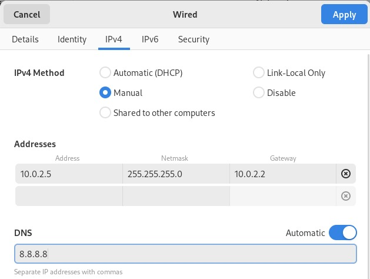
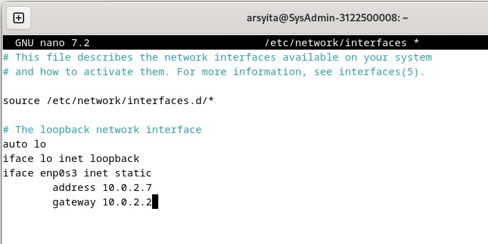
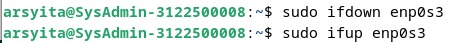
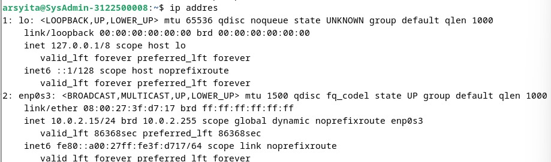
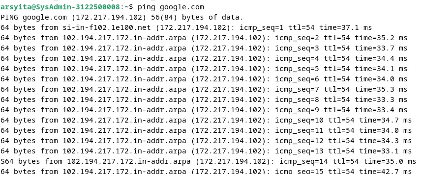

# 3. Mengubah Alamat IP Dinamis Menjadi Statis 

Untuk melakukan setting network di debian, kita memiliki dua cara yaitu melalui GUI (Network Manager) dan CLI (Menggunakan file /etc/network/interfaces).

Default Gateway :

#### A. NETWORK MANAGER
- Buka Network Manager (Anda bisa mencari "Network" di menu atas atau menggunakan perintah "nm-connection-editor" di terminal).

- Pilih interface yang terhubung/sambungkan terlebih dahulu.

- Buka setting pada interface tersebut.
- Pilih menu IPV4 lalu klik manual. Kemudian, masukkan konfigurasi alamat IP
  Address : 10.0.2.100
  Netmask : 255.255.255.0
  DNS : 8.8.8.8
  Lalu Klik Apply

#### B. Menggunakan interfaces File:

- Buka terminal.
- Buat file /etc/network/interfaces menggunakan text editor seperti nano atau vim.

- Isi file dengan konfigurasi yang diinginkan. Contoh:

- Simpan file dan keluar dari text editor.
- Jalankan perintah "sudo ifdown eth0" (gantikan "eth0" dengan nama interface yang ingin diatur) untuk mematikan interface. Lalu, Jalankan perintah "sudo ifup eth0" untuk mengaktifkan kembali interface dengan pengaturan yang baru.

- Kemudian cek menggunakan ~$ ip addr

- Lakukan pengujian!

Setelah melakukan salah satu cara di atas, pengaturan network di debian akan berubah sesuai dengan yang kita inginkan.
