# 8.6 Cleaning the system
Meskipun hard disk memiliki kapasitas yang lebih besar, pembersihan disk tetap diperlukan. Beberapa skrip otomatis dapat membantu, tetapi akan lebih baik memeriksa sebelum menggunakan perintah "rm" (singkatan dari remove).

### 1. Disk space information
Hal pertama yang harus dilakukan adalah mengetahui ruang yang terpasang pada disk.
1. Ruang disk dalam mode terminal
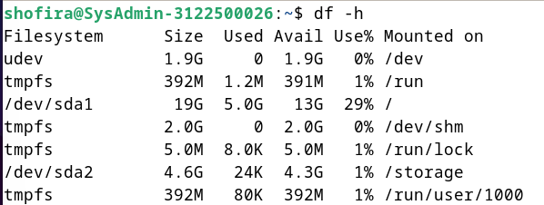
2. Daftar repositori yang disimpan berdasarkan urutan ukuran besar ke kecil menggunakan perintah:
   `"du -ms * | sort -nr"`
   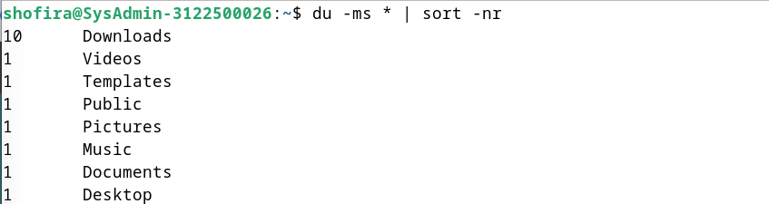
3. NCDU untuk menganalisis ruang disk dalam metode konsol ketik "ncdu", gunakan perintah: 
   `apt update && apt install ncdu`
   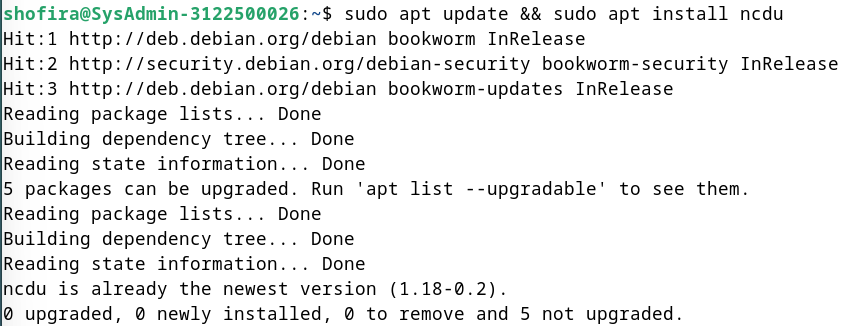
4. Baobab untuk menganalisis ruang disk dalam mode grafis dapat menggunakan perintah:
   `apt update && apt install baobab`
   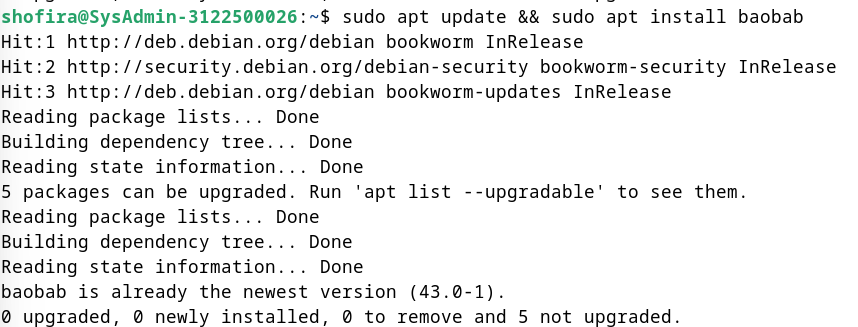

### 2. Cleaning the package
1. Bersihkan "apt cache" menggunakan perintah:
   `apt clean`
2. Paket yang tidak diperlukan dapat di hapus, namun periksa daftar paket yang akan dihapus lebih dahulu menggunakan perintah:
   `apt autoremove --purge`
   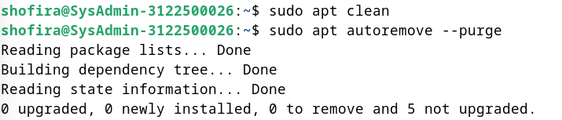
3. Buat daftar dan hapus paket lama menggunakan perintah: 
    ~~~
    apt list '?absoluter'
    apt remove '?absoluter'
    ~~~
    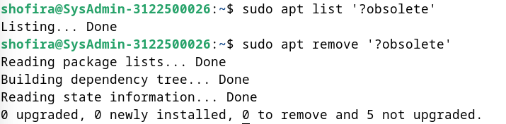
4. Bersihkan file konfigurasi yang tersisa menggunakan perintah:
   ~~~
   dpkg --list | awk '/^rc/ {print $2}'
   apt purge $(dpkg --list | awk '/^rc/ {print $2}')
   ~~~
   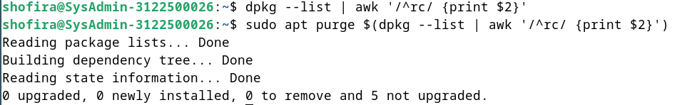
5. disarankan untuk menginstal alat deborphan yang dapat menampilkan daftar paket-paket yang tidak bergantung pada paket lain di sistem , berikut penginstalan deborphan dan jalankan:
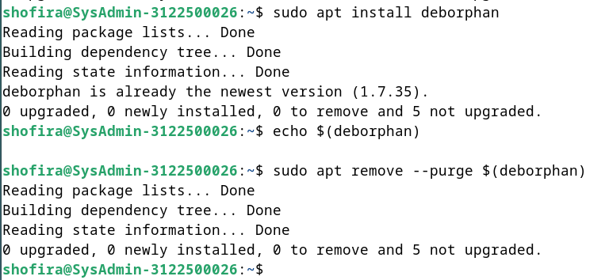

### 3. Emptying the trash bins
Ada tiga keranjang sampah yang perlu dipertimbangkan:
1. Keranjang sampah pengguna: Terletak di ~/.local/share/Trash/. Anda bisa mengosongkannya melalui pengelola file sistem atau terminal dengan perintah:
   `rm -Rf ~/.local/share/Trash/*`
    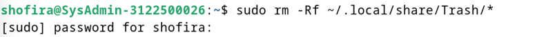
2. Keranjang sampah administrator: Terletak di /root/.local/share/Trash/. Anda perlu menggunakan terminal dalam mode administrator untuk mengosongkannya dengan benar:
   `rm -Rf /root/.local/share/Trash/*`
   
3. Keranjang sampah eksternal: Biasanya terletak di disk eksternal dengan alamat '/media/your_id/your_disk/.Trash_1000', dimana "your_id" adalah nama login Anda.

### 4. Purging application caches
Beberapa aplikasi menyimpan data di folder "cache" untuk meningkatkan performa. Jika ukurannya terlalu besar, Anda bisa menghapusnya dengan:
`rm -Rf ~/.cache/*`

Setiap aplikasi mengelola cache-nya dengan cara berbeda. Beberapa membersihkannya otomatis saat ditutup, beberapa menyimpan cache di /tmp yang terhapus saat logout, dan yang lain menyimpannya di folder khusus. Contohnya, untuk Firefox, Anda dapat membersihkan cache melalui menu preferensi dan mengotomatisasikan tindakan ini setiap kali aplikasi ditutup.

### 5. Purging the thumbnails
Setiap kali membuka folder dengan gambar atau video, thumbnail dibuat dan disimpan untuk digunakan kembali. Namun, ketika file grafis dihapus, thumbnail-nya tetap menyita ruang disk. Untuk membersihkannya:
`rm -Rf ~/.thumbnails`
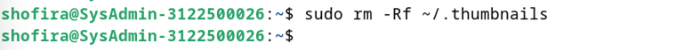
Folder ini akan dibuat kembali saat diperlukan untuk menyimpan thumbnail yang baru.

----
# 8.7 Installing external “.deb” package
Debian GNU/Linux menggunakan repositori paket untuk mengelola perangkat lunak dan meningkatkan keamanan sistem. Namun, terkadang diperlukan paket eksternal dalam format ".deb", yang berasal dari "Debian". Ini adalah format arsip terkompresi yang dapat ditangani oleh manajer paket Debian seperti APT dan Synaptic.

Install aplikasi .deb dari browser, misalnya install sublime-text dari Firefox
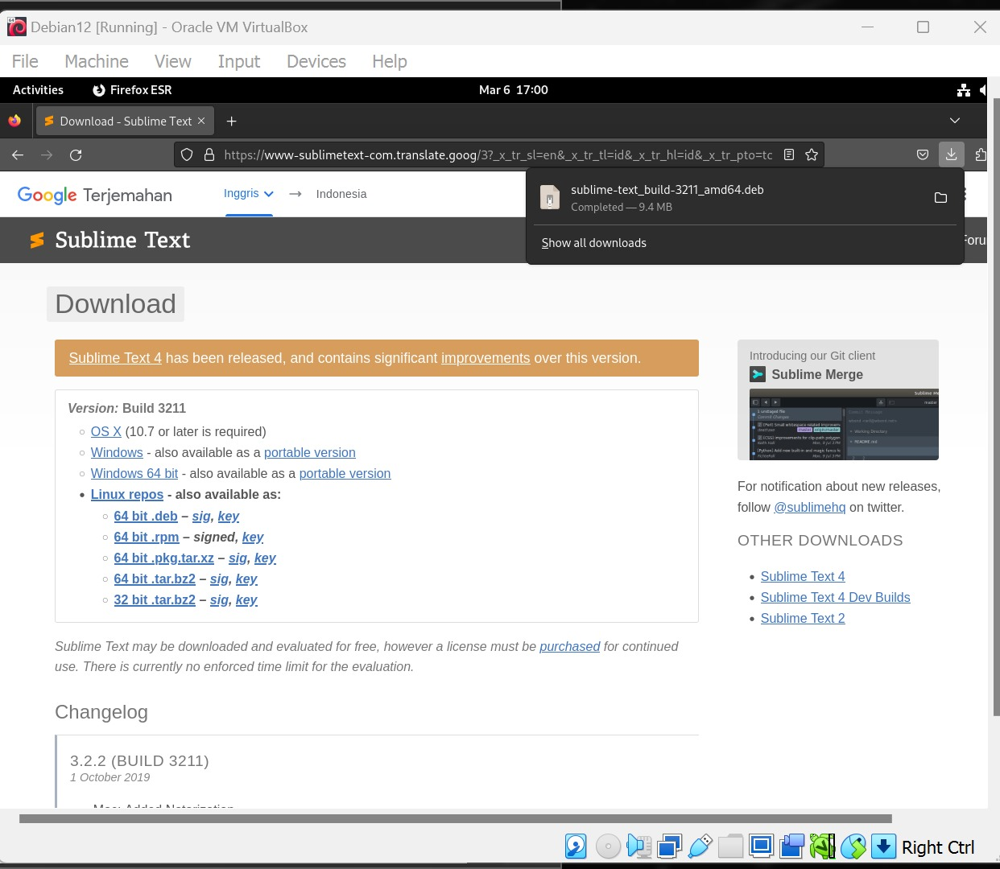
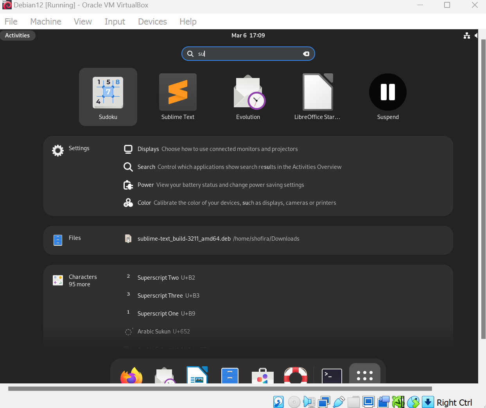
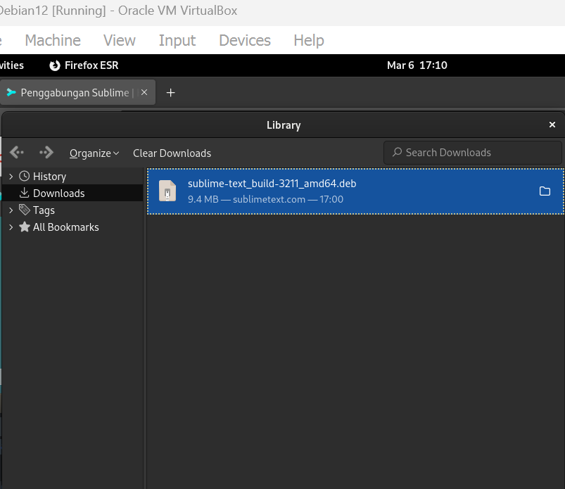

### 1. Installation in graphic mode with GDebi
GDebi adalah utilitas grafis untuk menginstal paket eksternal dalam format ".deb" dan mengelola dependensinya. Untuk installnya:
1. Cari "gdebi" di manajer favorit menggunakan perintah berikut:
   `apt update && apt install gdebi`
   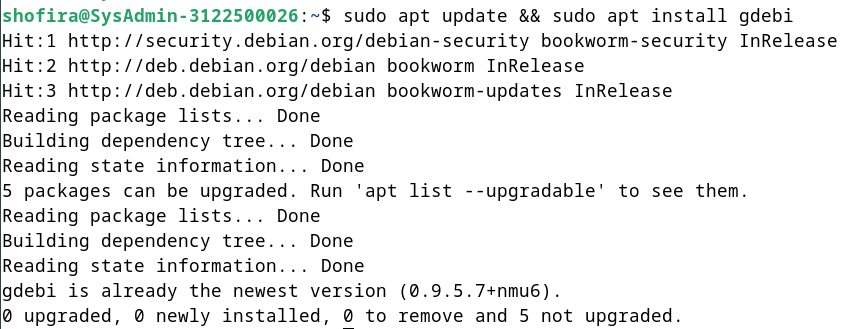
2. Klik kanan pada paket tersebut dan pilih "Open with gdebi"
   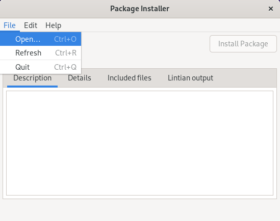
   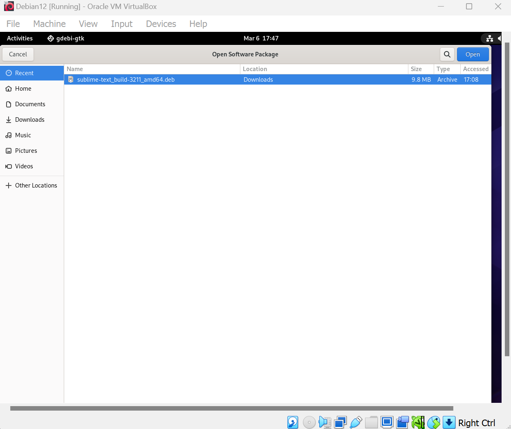
3. Klik "Install Package" dan kata sandi administrator akan diminta
   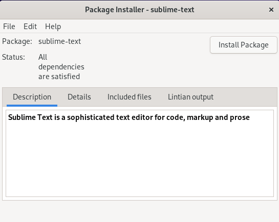
   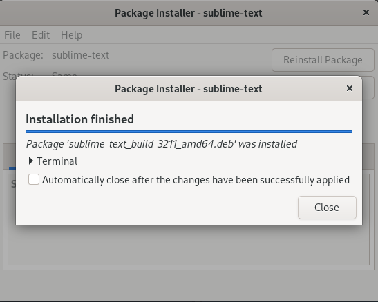
   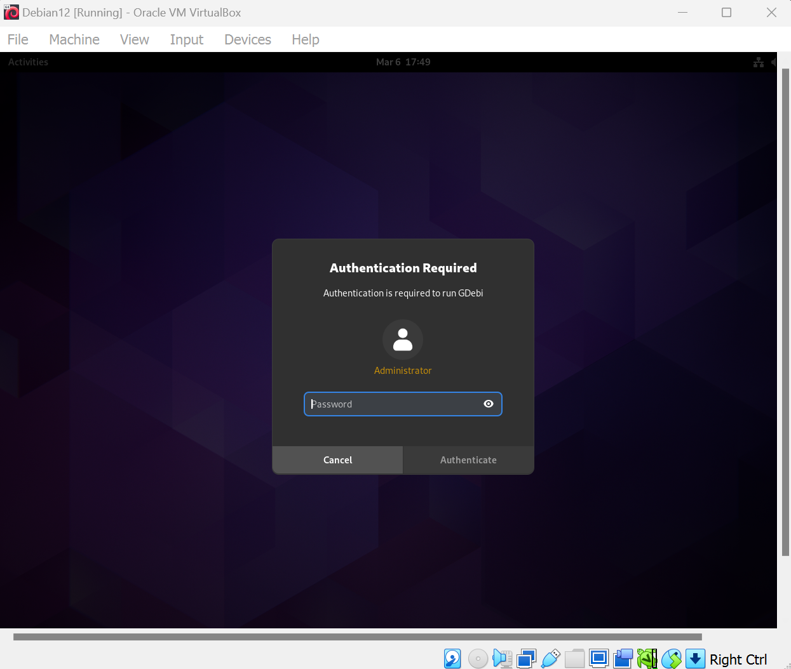
4. Jika ingin uninstall klik "Remove Package"
   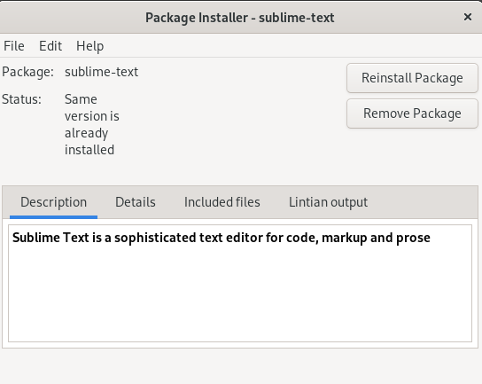
   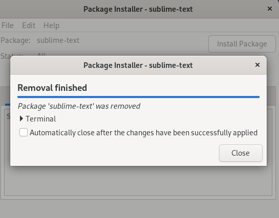

### 2. Installation in terminal mode with Dpkg
Dpkg adalah utilitas untuk mengelola paket perangkat lunak tanpa mengelola dependensi seperti apt.
1. Untuk menginstal paket eksternal dengan dpkg, gunakan perintah: 
   `dpkg -i package_name.deb`
   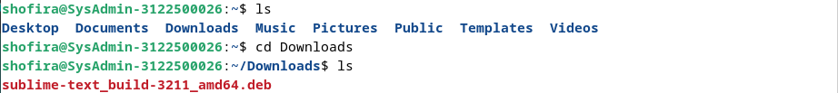
   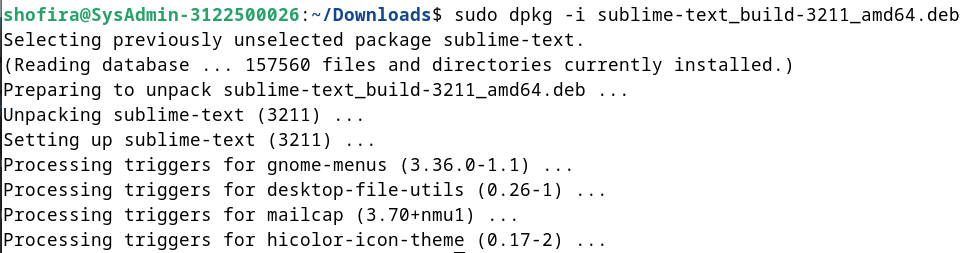
2. Jika ada pesan kesalahan terkait dependensi yang hilang, instal dependensi tersebut dengan apt menggunakan perintah : 
   `apt install dependency_1 dependency_2`
3. Untuk menghapus paket eksternal, gunakan perintah: 
   `dpkg --purge package_name`
   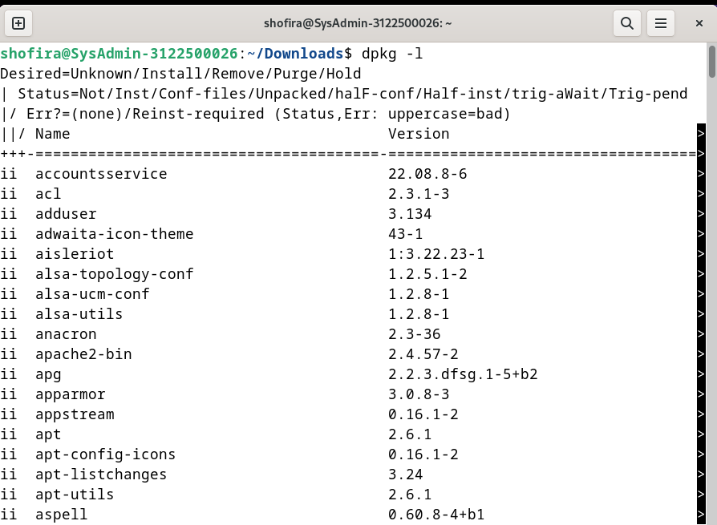
   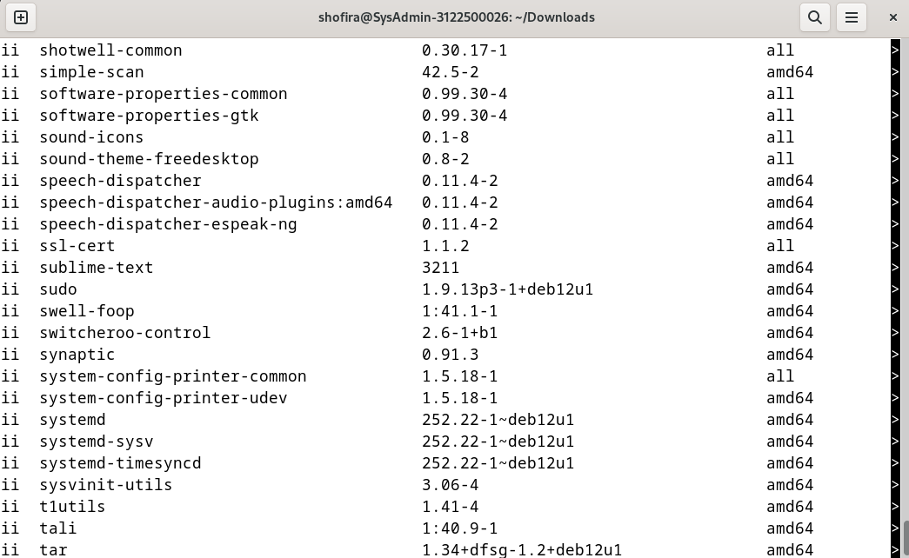
   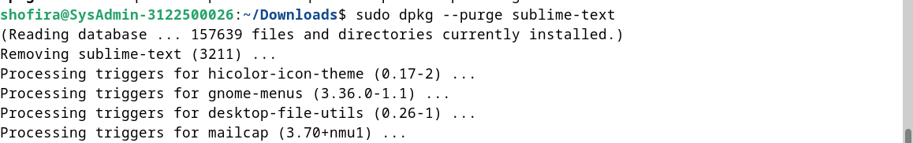
4. Dpkg terintegrasi secara default di Debian dan harus digunakan dalam mode administratif.