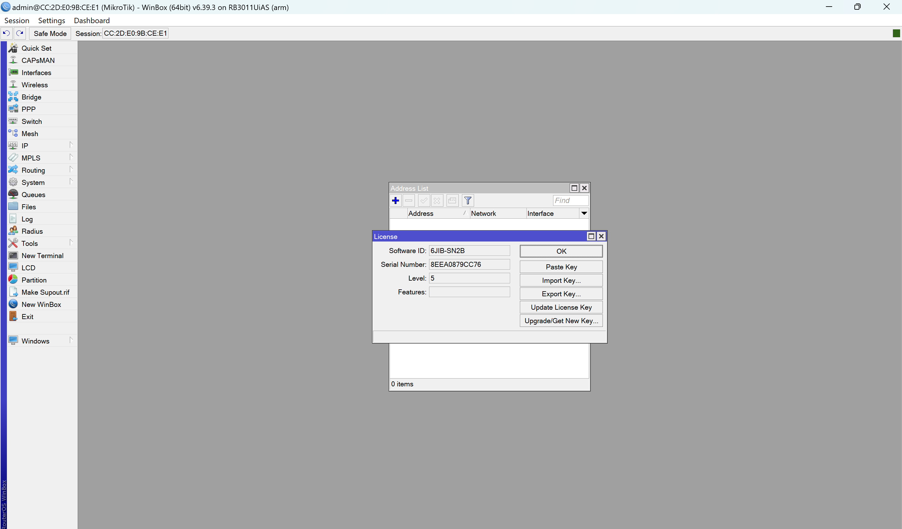
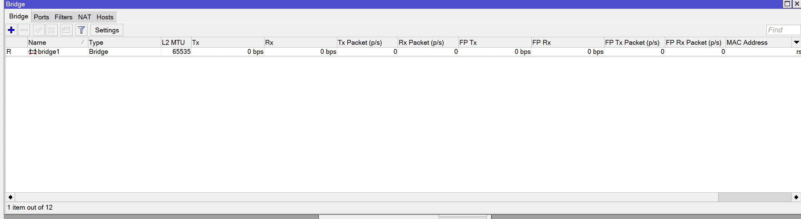

# Konfigurasi Subnetting MikroTik

## Langkah-langkah :

1. Buka terminal pada perangkat Debian dan jalankan perintah ip addr untuk menampilkan alamat IP yang sesuai dengan nomor meja komputer yang digunakan.

2. Reset konfigurasi perangkat MikroTik sehingga alamat IP berubah menjadi 192.168.88.102.

3. Sambungkan kabel WLAN pada laptop.

4. Download dan instal Winbox pada laptop. 
    <space> 

5. Jalankan Winbox pada laptop.

6. Hubungkan ke alamat fisik (MAC) yang tercantum di layar Winbox dengan mengklik MAC address kemudian klik connect. Jika terjadi pesan error, klik tools, pilih legacy mode, dan sambungkan kembali. 
    <space> 

7. Mengecek level mikrotik, cari 'System' di sidebar dan pilih License. Mikrotik yang digunakan memiliki level 5. 
    <space> 

8. Tambahkan alamat IP baru, pilih opsi 'IP', lalu klik 'Address List'. Tekan tanda plus biru untuk menambahkan entri baru. Isi kolom dengan alamat IP 192.168.88.5/24, network 192.168.88.0, dan pilih interface diether1.
 
    <space> 

9.  Buka terminal baru dan ketikkan perintah 'ping 192.168.88.254' untuk memeriksa apakah dapat terhubung dengan IP tersebut melalui jaringan.
 
    <space> 

10. Pilih opsi 'Bridge' dari menu samping dan tekan tanda plus untuk membuat bridge baru. Namai bridge tersebut 'bridge1' dan klik tombol apply. 
 
    <space> 

11. Navigasikan ke tab Ports, lalu tekan tombol tambah. Di bagian Bridge Port, pilih interface ether2 dan pilih Bridge bridge1. Lakukan langkah yang sama untuk ether3, ether4, dan ether5. 
 
    <space> 
    <space> 

12. Buka pengaturan gateway dari menu 'IP' di sidebar, lalu pilih opsi 'Route'. Tekan tanda plus untuk menambahkan route baru. Masukkan '0.0.0.0' sebagai alamat tujuan dan '192.168.88.254' sebagai gateway. Setelah itu, klik tombol apply untuk menyimpan perubahan yang telah Anda buat. 
 
    <space> 

13. Pada menu 'IP' di sidebar, buka opsi DHCP server. Di bagian DHCP Setup, pilih bridge1 sebagai antarmuka DHCP Server. Ubah rentang alamat pada opsi Set Addresses menjadi 192.168.5.200-192.168.5.254. Setelah itu, simpan perubahan yang telah dibuat. 
  
    <space> 

14. Akses menu 'IP' dan pilih opsi 'DNS'. Tambahkan server DNS dengan alamat PENS, yaitu 202.9.85.4. 

15. Langkah terakhir, konfigurasikan firewall dari menu 'IP' di sidebar. Pilih opsi NAT dan tekan tombol tambah. Masukkan alamat sumber (source address) sebagai 192.168.5.0/24 dan alamat tujuan (destination address) sebagai 0.0.0.0. Setelah itu, klik tombol apply untuk menyimpan pengaturan yang telah ditentukan. 
  
    <space> 

Setelah mengikuti langkah-langkah di atas dengan benar, MikroTik akan terhubung sesuai dengan konfigurasi yang telah ditentukan.