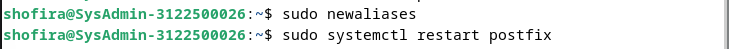
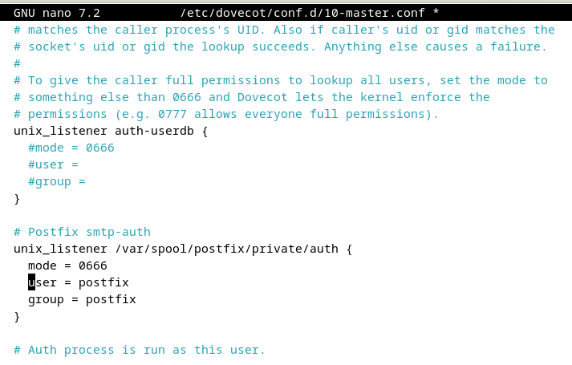
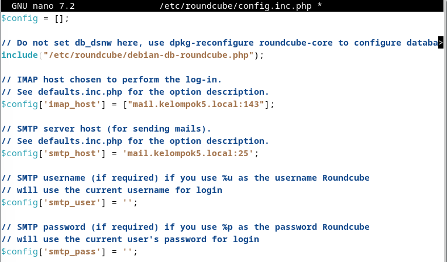
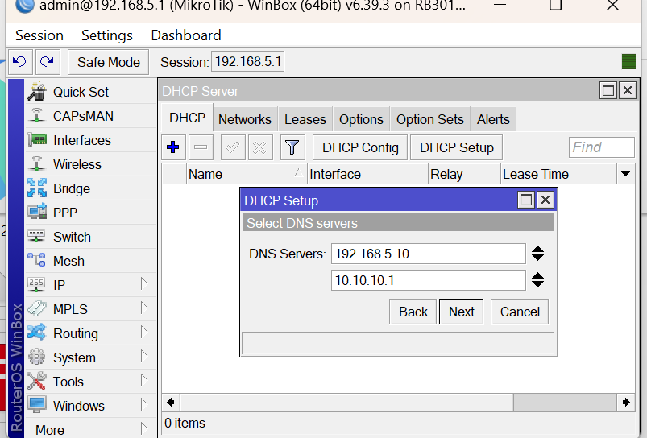

<h1 align="Center">LAPORAN WORKSHOP ADMINISTRASI JARINGAN</h1>

<h2 align="Center">WEB EMAIL SYSTEM SERVER</h2>

  

<h4 align="Center">Disusun oleh:</h4>

<h4 align="center">
Nama : Shofira Izza Nurrohmah  
NRP : 3122500026  
Kelas: 2 D3 IT A  
</h4>

<h4 align="center">
Dosen Pengampu : Dr Ferry Astika Saputra ST, M.Sc	
</h4>

 
<h4 align="center">
PROGRAM STUDI TEKNIK INFORMATIKA  
DEPARTEMEN TEKNIK INFORMATIKA DAN KOMPUTER 
POLITEKNIK ELEKTRONIKA NEGERI SURABAYA   
2024
</h4>   

<h4>NTP Client</h4>

1. Lakukan instalasi paket layanan sinkronisasi waktu
`sudo apt install systemd-timesyncd`

2. Pastikan konfigurasi timezone ke Asia/Jakarta
`sudo timedatectl set-timezone Asia/Jakarta`

3. Melakukan konfigurasi Real Time Clock (RTC) untuk merefer ke UTC (Coordinated Universal Time)
`sudo timedatectl set-local-rtc false`

4. Mengaktifkan NTP Client untuk sinkronisasi waktu
`sudo timedatectl set-ntp true`

5. Menyunting file timesyncd.conf untuk mengarah ke NTP server terdekat untuk mendapatkan waktu 
delay terpendek. Biasanya setiap organisasi atau negara mempunyai NTP Server sendiri
`sudo nano /etc/systemd/timesyncd.conf`

6. Restart layanan sinkronisasi waktu dan pastikan layanan berjalan dengan benar
- `sudo systemctl restart systemd-timesyncd`
- `sudo timedatectl set-ntp true`
- `sudo systemctl status systemd-timesyncd`

7. Lakukan pengecekan kesesuaian tanggal system dengan perintah
` timedatectl`

8. Pengecekan status
` timedatectl timesync-status`  

<h4>Apache 2 + PHP-FM</h4>

- <h5>Apache2</h5>
    
    1. Install Apache2
    `sudo apt -y install apache2`
    

    2. Mengkonfigurasi Apache2
    - `sudo nano /etc/apache2/conf-enabled/security.conf`
    

    - `sudo nano /etc/apache2/mods-enabled/dir.conf`
    

    - `sudo nano /etc/apache2/apache2.conf`
    

    - `sudo nano /etc/apache2/sites-enabled/000-default.conf`
    

    - `sudo systemctl reload apache2`
    

    3. Melakukan test ke web browser
    

- <h5>PHP 8.2</h5>
   
    1. Install PHP 8.2
    - `sudo apt -y install php8.2 php8.2-mbstring php-pear`
    

    2. Mengecek versi PHP yang telah diinstall
    `php -v`
    
    
    3. Verify installation to create a test script
    - `echo '<?php echo ``php -i``."\n"; ?>' > php_test.php`

    4. Menjalankan kode php yang telah dibuat
    - `php php_test.php | head`  
    

- <h5>PHP-FM</h5>

    1. Install PHP-FM
    - `sudo  apt -y install php-fpm`
    
  
    2. Mengkonfigurasi PHP-FM pada file konfigurasi Apache
    - `sudo nano /etc/apache2/sites-available/default-ssl.conf`
        
    - `sudo a2enmod proxy_fcgi setenvif`
        
    - `sudo a2enconf php8.2-fpm`
        
    - `sudo systemctl restart php8.2-fpm apache2`
        
    3. Melakukan test validasi terhadap PHP-FM dengan membuat file info.php di root document  
    `echo '<?php phpinfo(); ?>' > /var/www/html/info.php`  
    

    4. Melakukan test di browser
    

<h4>Database System : MariaDB</h4>

1. Instalasi Maria DB 10.11

- `sudo apt -y install mariadb-server`

- `sudo nano /etc/mysql/mariadb.conf.d/50-server.cnf`

- `systemctl restart mariadb`

2. Inisial konfigurasi dan testing database MariaDB Server
`mysql_secure_installation`

3. Masuk ke dalam mysql 

4. Mengecek akses user root

5. Mengecek daftar user pada database user

6. Melihat semua database

7. Membuat sebuah database beserta tabel untuk menjalankan query crud
- Membuat database

- Membuat tabel dengan kolom yang dibutuhkan pengguna

- Memasukkan data sesuai dengan kolom yang ada pada tabel.

- Melihat data yang ada pada tabel test_table dari database test_database

- Menghapus database yang sudah ada

<h4>Email System</h4>

- <h5>POSTFIX : SMTP Server (TCP 25)</h5>
    1. Install Postfix 
    `sudo apt -y install postfix sasl2-bin`

    
    
    

    2. Mengubah beberapa konfigurasi pada /etc/postfix/main.cf

    
    
    
    
    
    
    
    
    
    
    
    
    
    
    
      
    `disable_vrfy_command= yes`: mengatur apakah perintah ‘VRFY’ harus dinonaktifkan atau tidak.“smtpd_helo_required = yes”: mengatur apakah client SMTP diharuskan memberikan perintah ‘HELO’ sebelum diizinkan untuk mengirim email.“message_size_limit= 10240000”: mengatur batas ukuran pesan email yang diterima oleh server (dalam byte).

    
    10. Membuat atau mengupdate database alias Postfix setelah ada perubahan dalam file config alias (/etc/aliases)
    

    3. Menambahkan konfigurasi anti spam
    
      
    Client restrictions, sender restrictions, dan HELO restrictions pada server email Postfix.
    “permit_mynetworks”: Mengizinkan koneksi dari jaringan lokal (mynetworks)

- <h5>DOVECOT : IMAP4 (TCP 143) and POP3 (TCP110) Server</h5>
    
    1. Instalasi Dovecot Server
    `sudo apt -y install dovecot-core dovecot-pop3d dovecot-imapd`
    

    - `sudo nano /etc/dovecot/dovecot.conf`
      
    Menentukan network interface yang akan di-listen oleh server Dovecot 

    - `sudo nano /etc/dovecot/conf.d/10-auth.conf`
      
    Menonaktifkan otentikasi plaintext (tidak terenkripsi) user.
      
    Menentukan mekanisme otentikasi yang diperbolehkan untuk user yang terhubung ke server Dovecot. Ada dua mekanisme yaitu plain (tidak terkenkripsi) dan login (encode)

    - `sudo nano /etc/dovecot/conf.d/10-mail.conf`
      
    Menentukan direktori penyimpanan mailbox user.

    - `sudo nano /etc/dovecot/conf.d/10-master.conf`
      
    Mengatur config mekanisme otentikasi SASL pada Postfix
      - Baris pertama: Postfix akan listen koneksi SASL di socket UNIX pada direktori /var/spool/postfix/private/auth.
      - Baris kedua mengatur permissions pada socket Unix menjadi 0666, yang artinya dapat diakses oleh semua user
      - Baris ketiga, menentukan pengguna sistem yang akan digunakan oleh socket Unix tersebut
      - Baris keempat, menentukan grup sistem yang akan digunakan oleh socket Unix tsb

    - `sudo systemctl restart dovecot`
    

<h4>FINAL CHECK untuk semua SERVICES</h4>

<h4>Melakukan Cek terhadap Layanan Posfix</h4>

`telnet mail.kelompok5.local 25`

<h4>Thunderbird (Email GUI Client)</h4>

1. Install Thunderbird melalui CLI  

2. Melalukan run pada Thunderbird  

3. Setup nama, email, dan password pengguna

4. Tambahkan user baru dengan setup nama, email, dan password

5. Melakukan kirim pesan email

<h4>RoundCube (Webmail)</h4>

1. Membuat sebuah Database RoundCube
- `sudo mysql -u root -p` membuka client baris perintah MariaDB, meminta koneksi ke server MariaDB menggunakan user root dan password pengguna tersebut. Kemudian memberikan akses ke consol MariaDB untuk melakukan operasi database
    - `create database roundcube` untuk membuat database bernama "roundcube" di server MariaDB
    - `grant all privileges on roundcube.* to roundcube@``localhost`` identified by ``password``;` memberikan semua hak akses ke database "roundcube" kepada pengguna 'roundcube'@'localhost'. Kata sandi 'password' adalah kata sandi yang diberikan untuk pengguna 'roundcube'.  
    

2. Install dan Konfigurasi RoundCube

- Mengimpor skema database Roundcube ke database "roundcube"

- `sudo nano /etc/roundcube/debian-db.php`
  
Membuka file debian-db.php dari RoundCube yang  berisi konfigurasi database untuk RoundCube.

- `sudo nano /etc/roundcube/config.inc.php`
  
Membuka file konfigurasi config.inc.php dari RoundCube yang berisi konfigurasi umum untuk aplikasi RoundcCube.

- `sudo nano /etc/apache2/conf-enabled/roundcube.conf`
  
Membuka file konfigurasi roundcube.conf dari Apache yang berisi konfigurasi untuk mengonfigurasi akses ke aplikasi RoundCube melalui server web Apache.

- `sudo systemctl restart apache2`
Melakukan restart layanan Apache setelah mengubah konfigurasi agar dapat diterapkan pada aplikasi Roundcube yang diakses melalui web server.

- Buka roundcube di web browser

- Melakukan kirim (send) email

Melakukan tes melalui web server dengan alamat domain local /roundcube. Login menggunakan username dan password yang telah disetting, lalu kirim pesan antar user, untuk melihat roundcube sudah berjalan dengan sesuai atau belum. Jika berhasil maka message atau pesan antar user bisa terkirim dan terbaca.

## Melanjutkan setup web email server
1. Mengubah network NAT menjadi Bridged Adapter dengan name Realtek USB FE Family Controller
   
   
2. Mengubah IP menjadi 192.168.5.10 
   
   

3. Mengubah file nano named.conf.options
   
   

4. Mengubah file /etc/resolv.conf  
    

5. Melakukan pengecekkan dengan nslookup  
    

6. Melakukan setting WinBox
   
   
7. Melakukan Testing atau uji coba
   - Melakukan pengepingan pada detik.com
   
   - Melakukan pengepingan pada ip kelompok6
   

8. Melakukan pengiriman pesan antar kelompok dengan RoundCube
   - Melakukan pengiriman pesan dari arsyita@mail.kelompok5.local ke iqbal@mail.kelompok6.local
    
   - Melakukan penerimaan pesan dari adam@mail.kelompok8.local ke arsyita@mail.kelompok5.local
    
   

## Melanjutkan Tugas 5 (SMTP, POP3, dan MIME)
### SMTP

> Pengiriman email dari client (device lainnya)

Simple Mail Transfer Protocol (SMTP) adalah sebuah protokol standar untuk mengirim email di internet. SMTP biasa bekerja ketika mengirim email dari email client ke email server lain atau dari satu email server ke email server lainnya. 
Dari praktek di atas, kami menghubungkan ke IP 192.168.5.10 melalui protokol telnet dengan port 25. Port 25 merupakan port non-enkripsi default SMTP. Dengan perintah tersebut, kami menghubungkan ke server email yang mungkin berjalan di alamat IP tersebut.

- `ehlo mail.kelompok5.local` untuk mengkoneksikan ke server email dibuat.
- `mail from` untuk menentukan alamat email pengirim.
- `rcpt to` untuk menentukan alamat email penerima.

### POP3

Post Office Protocol version 3 atau POP3 adalah sebuah protokol email standard yang digunakan untuk menerima email dari sebuah server email ke email client yang digunakan. Dengan POP3, kita dapat mendownload pesan-pesan yang ada pada server email ke komputer atau device dan bisa membacanya bahkan ketika komputer offline atau tidak terkoneksi dengan internet. Jika menggunakan POP3 untuk berhubungan dengan akun email, email-email kita akan didownload ke device lokal dan dihapus dari server email kita. Jadi, jika ingin bisa mengakses email dari beberapa aplikasi yang berbeda, POP3 bukanlah pilihan yang tepat. 
Dari praktek di atas, kami menghubungkan ke IP 192.168.5.10 melalui protokol telnet dengan port 110. Port 110 merupakan port non-enkripsi default POP3. 

- `user arsyita` untuk melakukan login/masuk sebagai arsyita.
- `pass Surabaya24` untuk memasukkan password.
- `list` untuk melihat jumlah daftar pesan email yang diterima.
- `retr 33` untuk melihat dan membuka pesan email dari salah satu email yang diterima sesuai dengan nomor urutannya.

### MIME

Multipurpose Internet Mail Extensions atau MIME Type adalah standar internet yang menjelaskan konten file internet berdasarkan sifat dan format dokumen, file, atau kumpulan byte yang membantu browser membuka file dengan ekstensi atau plugin yang sesuai. Ini didefinisikan dan distandarisasi dalam IETF's RFC 6838.

Tipe MIME berisi dua bagian, yaitu.
1. Type, menjelaskan kategorisasi tipe MIME yang ditautkan satu sama lain.
Subtype, unik untuk tipe file tertentu yang merupakan bagian dari tipe.
2. Browser menggunakan jenis MIME, bukan ekstensi file, untuk menentukan cara memproses URL, sehingga web server harus mengirimkan jenis MIME yang benar di header jenis konten respons. Jika ini tidak dikonfigurasi dengan benar, browser mungkin salah menafsirkan konten file dan situs tidak akan bekerja dengan benar, dan file yang diunduh mungkin salah dalam penanganan.

#### Struktur  MIME type
Tipe MIME yang paling sederhana terdiri dari satu tipe dan subtipe. Setiap string yang jika digabungkan dengan garis miring (/) di antaranya, akan membentuk tipe MIME. Tidak ada spasi yang diizinkan dalam tipe MIME:

type/subtype
Type tersebut mewakili kategori umum tempat tipe data berada, seperti video atau teks. Subtype mengidentifikasi jenis data yang tepat dari jenis tertentu yang diwakili oleh jenis MIME. Misalnya, untuk teks jenis MIME, subjenisnya mungkin file biasa (teks biasa), html (kode sumber HTML), atau kalender (untuk iCalendar / .ics). Setiap tipe memiliki kumpulan subtipe yang memungkinkan, dan tipe MIME selalu memiliki tipe dan subtipe, tidak pernah hanya satu atau yang lain.

Parameter opsional dapat ditambahkan untuk memberikan detail tambahan:
type/subtype;parameter=value
Misalnya, untuk semua tipe MIME yang jenis utamanya adalah teks, parameter opsional charset untuk menentukan rangkaian karakter yang digunakan (karakter dalam data). Jika tidak, defaultnya adalah ASCII (US-ASCII) kecuali diganti oleh pengaturan agen pengguna. Untuk menentukan file teks UTF-8, tipe MIME text/plain; charset = UTF-8 digunakan.

#### Jenis-Jenis MIME Type
Ada dua kelas tipe: discrete dan multipart. Jenis diskrit adalah jenis yang mewakili satu file atau media, seperti satu teks atau file musik, atau video. Jenis multipart adalah salah satu yang mewakili dokumen yang terdiri dari beberapa bagian komponen, yang masing-masing mungkin memiliki jenis MIME tersendiri; atau, tipe multipart dapat merangkum banyak file yang dikirim bersama dalam satu transaksi. Misalnya, tipe MIME multipart digunakan saat melampirkan banyak file ke email.

Dengan pengecualian multipart/form-data, digunakan dalam metode POST pada HTML Forms, dan multipart/byteranges, digunakan dengan 206 Partial Content untuk mengirim bagian dari dokumen, HTTP tidak menangani dokumen multipart dengan cara khusus: pesan ditransmisikan ke browser.
