<h1 align="Center">LAPORAN WORKSHOP ADMINISTRASI JARINGAN</h1>

<h2 align="Center">WEB EMAIL SYSTEM SERVER</h2>

  

<h4 align="Center">Disusun oleh:</h4>

<h4 align="center">
Nama : Shofira Izza Nurrohmah  
NRP : 3122500026  
Kelas: 2 D3 IT A  
</h4>

<h4 align="center">
Dosen Pengampu : Dr Ferry Astika Saputra ST, M.Sc	
</h4>

 
<h4 align="center">
PROGRAM STUDI TEKNIK INFORMATIKA  
DEPARTEMEN TEKNIK INFORMATIKA DAN KOMPUTER 
POLITEKNIK ELEKTRONIKA NEGERI SURABAYA   
2024
</h4>   

<h4>NTP Client</h4>

1. Lakukan instalasi paket layanan sinkronisasi waktu
`sudo apt install systemd-timesyncd`
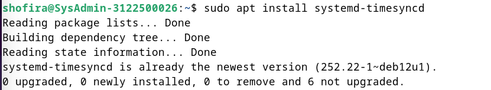

2. Pastikan konfigurasi timezone ke Asia/Jakarta
`sudo timedatectl set-timezone Asia/Jakarta`

3. Melakukan konfigurasi Real Time Clock (RTC) untuk merefer ke UTC (Coordinated Universal Time)
`sudo timedatectl set-local-rtc false`

4. Mengaktifkan NTP Client untuk sinkronisasi waktu
`sudo timedatectl set-ntp true`

5. Menyunting file timesyncd.conf untuk mengarah ke NTP server terdekat untuk mendapatkan waktu 
delay terpendek. Biasanya setiap organisasi atau negara mempunyai NTP Server sendiri
`sudo nano /etc/systemd/timesyncd.conf`
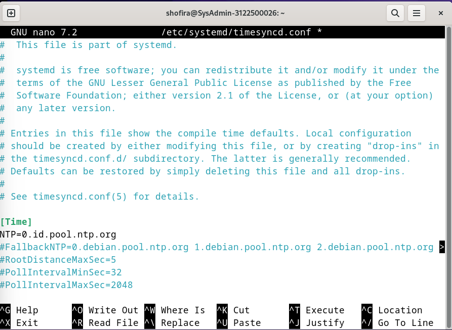

6. Restart layanan sinkronisasi waktu dan pastikan layanan berjalan dengan benar
- `sudo systemctl restart systemd-timesyncd`
- `sudo timedatectl set-ntp true`
- `sudo systemctl status systemd-timesyncd`
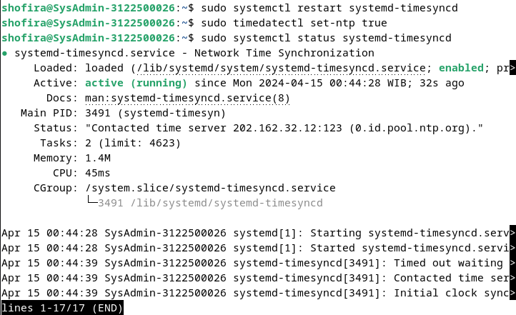

7. Lakukan pengecekan kesesuaian tanggal system dengan perintah
` timedatectl`
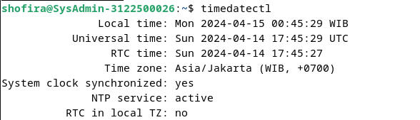

8. Pengecekan status
` timedatectl timesync-status`

<h4>Apache 2 + PHP-FM</h4>

- <h5>Apache2</h5>
    
    1. Install Apache2
    `sudo apt -y install apache2`
    

    2. Mengkonfigurasi Apache2
    - `sudo nano /etc/apache2/conf-enabled/security.conf`
    
    - `sudo nano /etc/apache2/mods-enabled/dir.conf`
    
    - `sudo nano /etc/apache2/apache2.conf`
    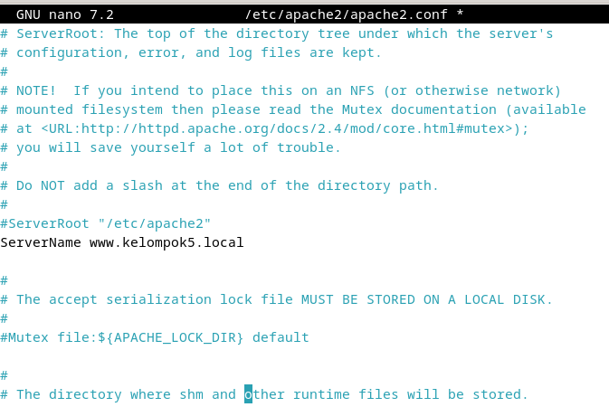
    - `sudo nano /etc/apache2/sites-enabled/000-default.conf`
    
    - `sudo systemctl reload apache2`
    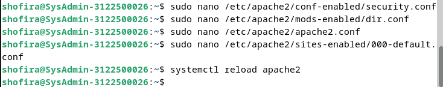

    3. Melakukan test ke web browser
    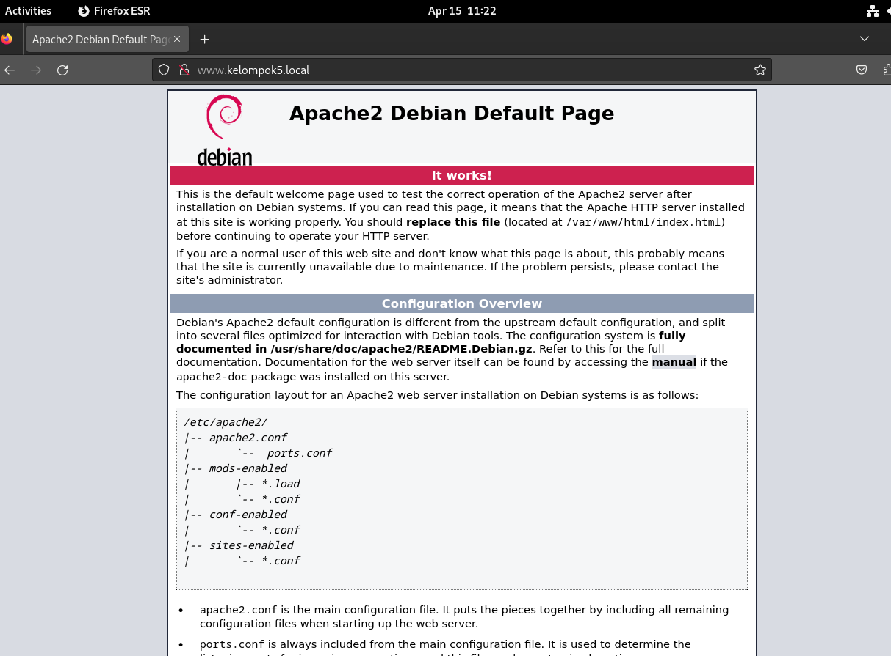

- <h5>PHP 8.2</h5>
    1. Install PHP 8.2
     `sudo apt -y install php8.2 php8.2-mbstring php-pear`
    
    

    2. Mengecek versi PHP yang telah diinstall
    `php -v`
    
    
    3. Verify installation to create a test script
    `echo '<?php echo ``php -i``."\n"; ?>' > php_test.php`

    4. Menjalankan kode php yang telah dibuat
    `php php_test.php | head`

        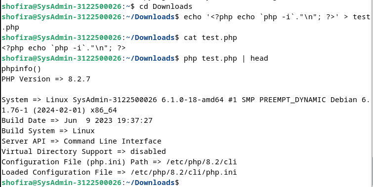

- <h5>PHP-FM</h5>
    1. Install PHP-FM

    `sudo  apt -y install php-fpm`

    
  
    2. Mengkonfigurasi PHP-FM pada file konfigurasi Apache
    
    - `sudo nano /etc/apache2/sites-available/default-ssl.conf`
        
    - `sudo a2enmod proxy_fcgi setenvif`
        
    - `sudo a2enconf php8.2-fpm`
        
    - `sudo systemctl restart php8.2-fpm apache2`
        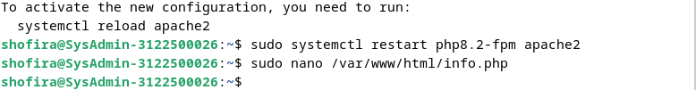
    3. Melakukan test validasi terhadap PHP-FM dengan membuat file info.php di root document
    `echo '<?php phpinfo(); ?>' > /var/www/html/info.php`
    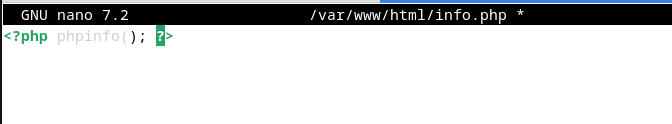

    4. Melakukan test di browser
    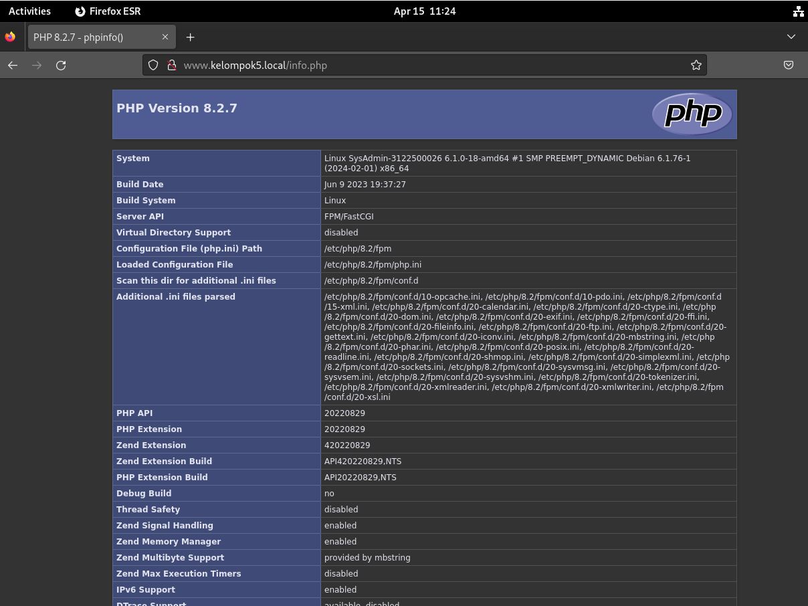

<h4>Database System : MariaDB</h4>

1. Instalasi Maria DB 10.11

- `sudo apt -y install mariadb-server`

- `sudo nano /etc/mysql/mariadb.conf.d/50-server.cnf`

- `systemctl restart mariadb`

2. Inisial konfigurasi dan testing database MariaDB Server
`mysql_secure_installation`
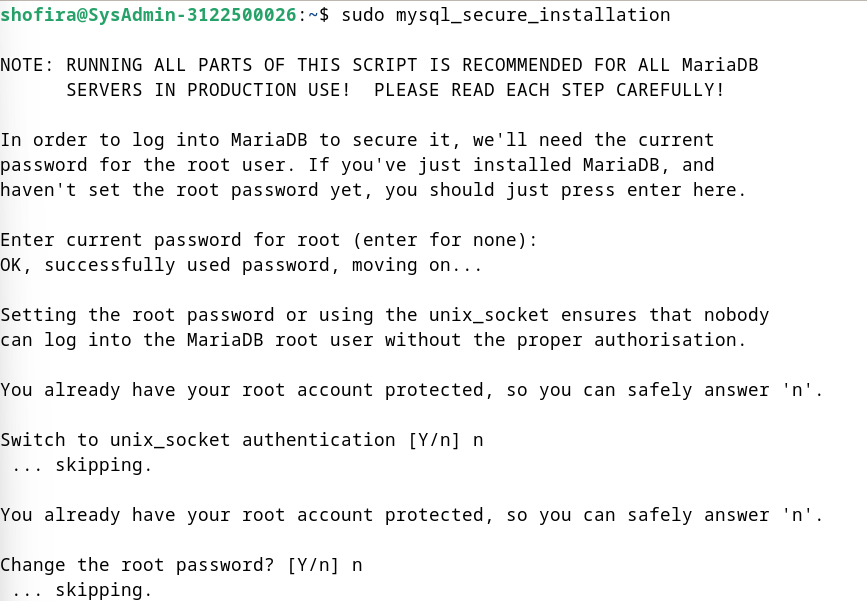
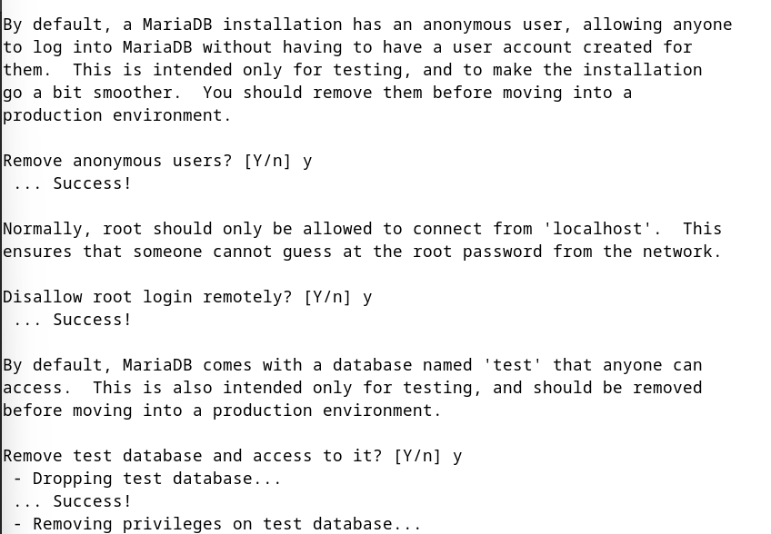
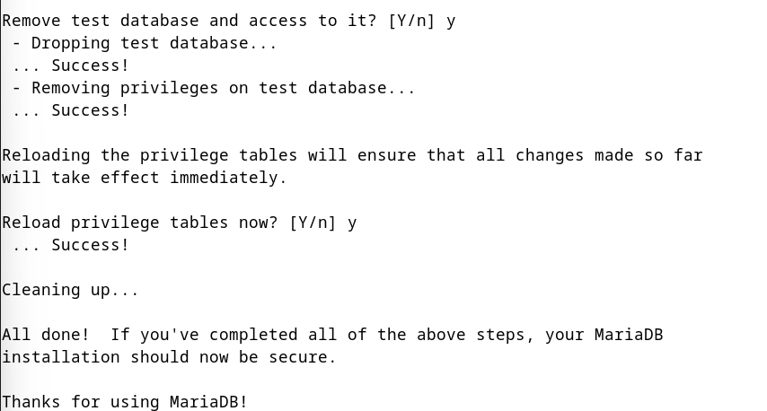

3. Masuk ke dalam mysql 
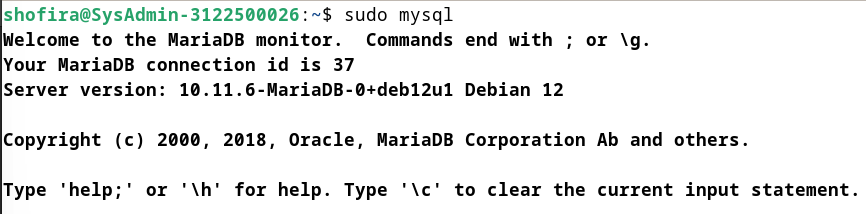

4. Mengecek akses user root
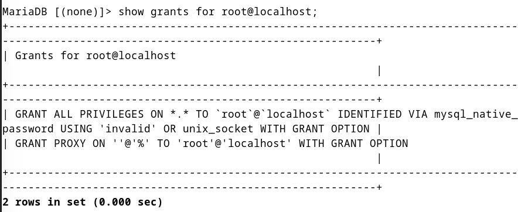

5. Mengecek daftar user pada database user

6. Melihat semua database

7. Membuat sebuah database beserta tabel untuk menjalankan query crud

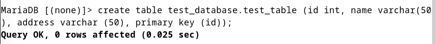

<h4>Email System</h4>

- <h5>POSTFIX : SMTP Server (TCP 25)</h5>
    1. Install Postfix 
    `sudo apt -y install postfix sasl2-bin`

    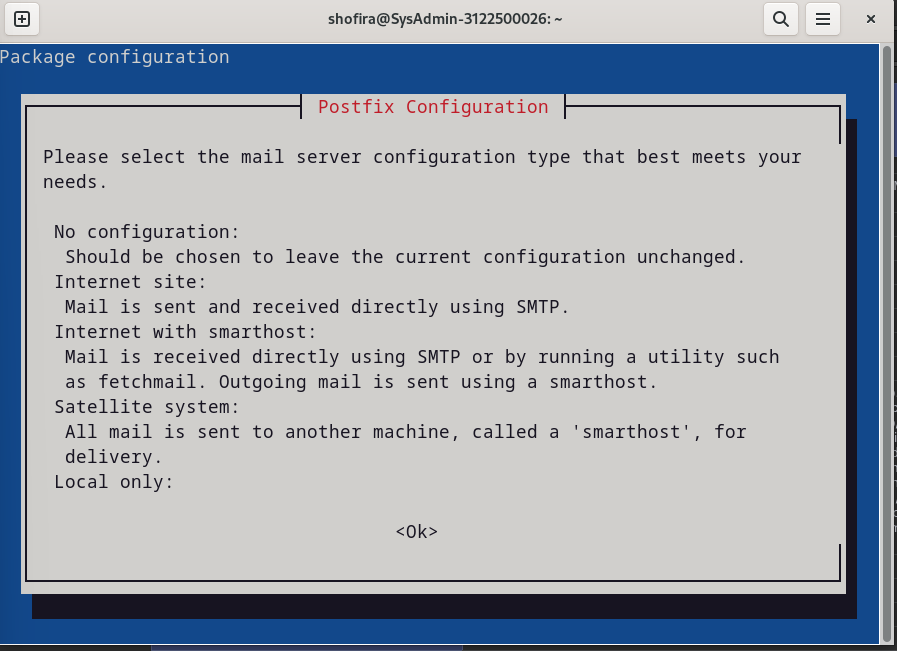
    
    

    2. Mengubah beberapa konfigurasi pada /etc/postfix/main.cf

    
    
    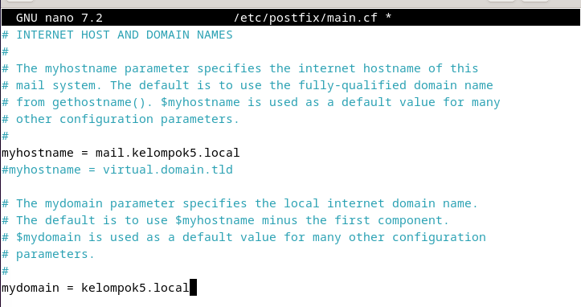
    
    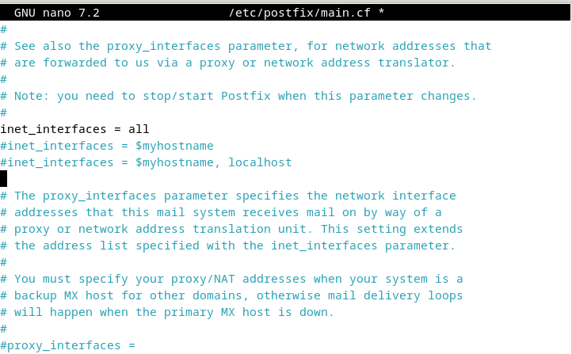
    
    
    
    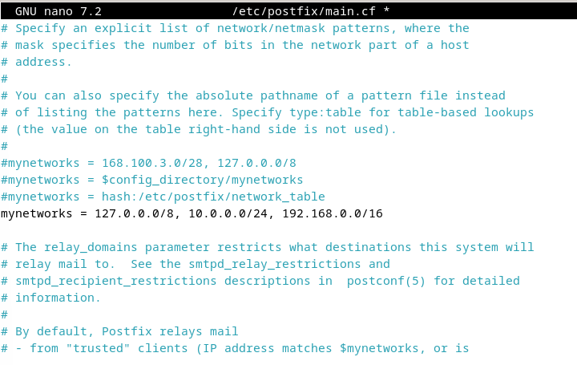
    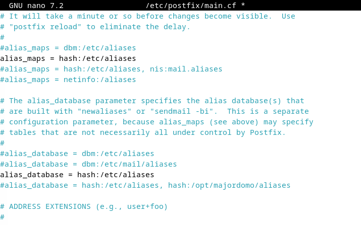
    
    
    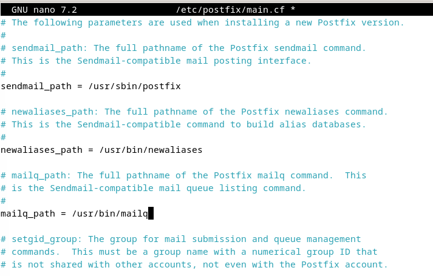
    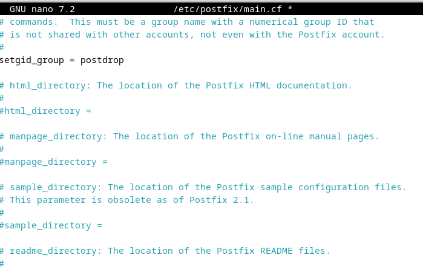
    
    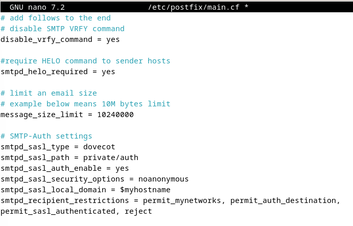
    

    3. Menambahkan konfigurasi anti spam

    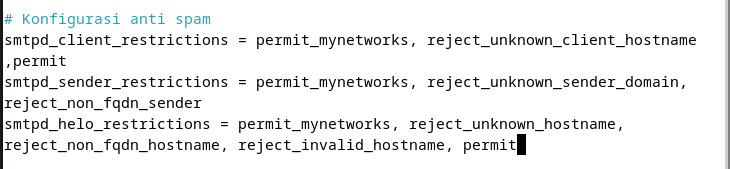
    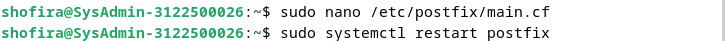

- <h5>DOVECOT : IMAP4 (TCP 143) and POP3 (TCP110) Server</h5>
    1. Instalasi Dovecot Server
    `apt -y install dovecot-core dovecot-pop3d dovecot-imapd`

    

<h4>FINAL CHECK untuk semua SERVICES</h4>

<h4>Melakukan Cek terhadap Layanan Posfix</h4>
`telnet mail.kelompok5.local 25`