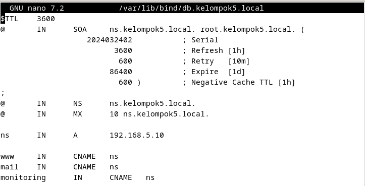

<h1 align="Center">LAPORAN WORKSHOP ADMINISTRASI JARINGAN</h1>

  

<h4 align="Center">Disusun oleh:</h4>

<h4 align="center">
Nama : Shofira Izza Nurrohmah  
NRP : 3122500026  
Kelas: 2 D3 IT A  
</h4>

<h4 align="center">
Dosen Pengampu : Dr Ferry Astika Saputra ST, M.Sc	
</h4>

 
<h4 align="center">
PROGRAM STUDI TEKNIK INFORMATIKA  
DEPARTEMEN TEKNIK INFORMATIKA DAN KOMPUTER 
POLITEKNIK ELEKTRONIKA NEGERI SURABAYA   
2024
</h4>   

<h3>Containerization</h3>

1. <h4>Before Install Docker Engine, Uninstall Conflicted</h4>
- `for pkg in docker.io docker-doc docker-compose podman-docker containerd runc; do sudo apt-get remove $pkg; done`

2. <h4>Install Docker Engine</h4>

- Add Docker's official GPG key: 
- `sudo apt-get update`

- `sudo apt-get install ca-certificates curl`

- `sudo install -m 0755 -d /etc/apt/keyrings`

- `sudo curl -fsSL https://download.docker.com/linux/debian/gpg -o /etc/apt/keyrings/docker.asc`

- `sudo chmod a+r /etc/apt/keyrings/docker.asc`

- <h5>Add the repository to Apt sources:</h5>
`echo \`

`"deb [arch=$(dpkg --print-architecture) signed-by=/etc/apt/keyrings/docker.asc] https://download.docker.com/linux/debian \`

` $(. /etc/os-release && echo "$VERSION_CODENAME") stable" | \`

`sudo tee /etc/apt/sources.list.d/docker.list > /dev/null`

`sudo apt-get update`

3. <h4>Install Docker Packages</h4>
`sudo apt-get install docker-ce docker-ce-cli containerd.io docker-buildx-plugin docker-compose-plugin`

4. <h4>Start Docker Engine</h4>
`sudo service docker start`

5. <h4>Run a Container</h4>
Command : docker run [image-name]
`sudo docker run hello-world`

<h4>Menjalankan project docker-example dari github</h4>

1. Clone dari github
`git clone https://github.com/alfiyansys/docker-examples.git`

2. Build ke dalam docker images
`docker build -t example`

3. Menjalankan docker images
`docker run -p 3000:80 example`

4. Buka port berikut pada browser
http://localhost:3000

<h4></h4>

1. Run Uptime-Kuma monitoring service using docker: https://github.com/louislam/uptime-kuma
    - `docker run -d --restart=always -p 3001:3001 -v uptime-kuma:/app/data --name uptime-kuma louislam/uptime-kuma:1`
    

    - Pengecekan pada port 3000
    `http://localhost:3000`
    

2. Run using virtualhost with access domain, example: http://monitoring.kelompokX.local 

- Konfigurasi file db.kelompok5.local
-  > Menambahkan monitoring pada CNAME ns
`sudo nano /var/lib/bind/db.kelompok5.local`

`sudo systemctl restart named`

- Install a2enmod
`sudo a2enmod`

Memasukkan package proxy
`proxy proxy_ajp proxy_http rewrite deflate headers proxy_balancer proxy_connect proxy_html`

- Konfigurasi Apache2
`sudo nano /etc/apache2/sites-enabled/000-default.conf`

Menambahkan beberapa baris untuk monitoring subdomain dengan proxy
`sudo systemctl restart apache2`

- Cek dengan browser
