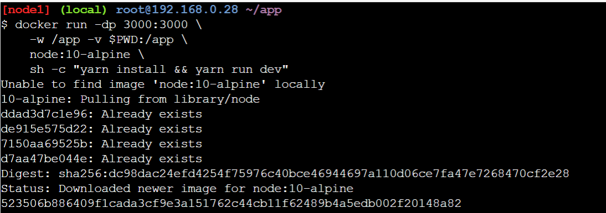
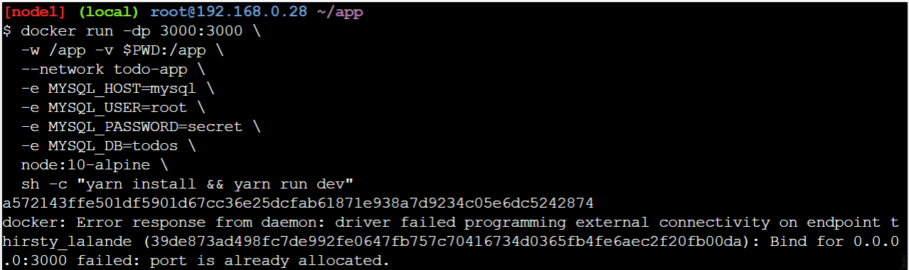

<h1 align="Center">LAPORAN WORKSHOP ADMINISTRASI JARINGAN</h1>

  

<h4 align="Center">Disusun oleh:</h4>

<h4 align="center">
Nama : Shofira Izza Nurrohmah  
NRP : 3122500026  
Kelas: 2 D3 IT A  
</h4>

<h4 align="center">
Dosen Pengampu : Dr Ferry Astika Saputra ST, M.Sc	
</h4>

 
<h4 align="center">
PROGRAM STUDI TEKNIK INFORMATIKA  
DEPARTEMEN TEKNIK INFORMATIKA DAN KOMPUTER 
POLITEKNIK ELEKTRONIKA NEGERI SURABAYA   
2024
</h4>   

### PLAY WITH DOCKER LABS
Buka link di bawah ini pada browser
https://www.docker.com/101-tutorial/

Masuk ke https://labs.play-with-docker.com/ untuk mengakses terminal PWD Anda

Setelah login kemudian klik Start. Setelah muncul halaman seperti di bawah ini, “add new instance”.

Ketik perintah berikut di terminal PWD: 
docker run -dp 80:80 docker/getting-started:pwd

Keterangan:
-d - menjalankan container dalam mode terpisah (di latar belakang)
-p 80:80 - memetakan port 80 dari host ke port 80 di container

Tunggu hingga container dimulai dan klik icon port 80, akan menampilkan halaman seperti berikut tentang langkah-langkah cara menggunakan docker 101 pada pwd

### OUR APPLICATION
- Getting our App into PWD
Download zip dan upload ke Play with Docker. Atau dengan melakukan drag and drop (atau file lainnya) ke terminal di PWD. Kemudian, ekstrak file zip.

- Ubah direktori kerja Anda saat ini ke folder 'aplikasi' baru menggunakan `cd app/`. Di direktori ini, Anda akan melihat aplikasi sederhana berbasis Node dengan perintah `ls`

#### Building the App's Container Image

1. Buat file bernama Dockerfile dengan konten berikut.
2. Build container image menggunakan perintah docker build.

#### Starting an App Container
1. Mulai kontainer menggunakan perintah docker run

2. Buka aplikasi dengan mengklik badge "3000" di bagian atas antarmuka PWD. Setelah terbuka, akan tertampil todo list yang kosong!

### UPDATING OUR APP
#### Updating our Source Code
1. Dalam file ~/app/src/static/js/app.js, perbarui baris 56 untuk menggunakan teks kosong yang baru.

2. Buat versi gambar terbaru kita, menggunakan perintah yang sama yang kita gunakan sebelumnya.

3. Mulai container baru menggunakan kode yang diperbarui.

Dan terlihat terdapat error sehingga tidak dapat memulai container baru karena container lama masih berjalan dan menggunakan port host 3000 dan hanya satu proses (termasuk container) yang dapat listen port tertentu. Untuk memperbaikinya, kita perlu menghapus container lama.

#### Replacing our Old Container
1. Untuk menghapus sebuah container, container tersebut harus dihentikan terlebih dahulu.
2. Kemudian, itu bisa dihilangkan/dihapus
3. Dapatkan ID kontainer dengan menggunakan perintah docker ps.
4. Gunakan perintah docker stop untuk menghentikan container.

5. Setelah container berhenti, hapus dengan menggunakan perintah docker rm. Kemudian run untuk mulai aplikasi yang diperbarui.

6. Buka aplikasi dan lihat teks bantuan terbaru!

### SHARING OUR APP

#### Create a Repo
1. Untuk push image, buat repo di Docker Hub.
2. Buka Docker Hub dan login.
3. Klik tombol Buat Repository.
4. Untuk nama repo, gunakan 101-todo-app. Pastikan Visibilitasnya Publik.
5. Klik tombol Create!

#### Pushing Our Image

Dengan menggunakan perintah `docker push shofira/101-todo-app`, akan terlihat pesan gagal karena perintah push sedang mencari gambar bernama shofira/101-todo-app, tetapi tidak menemukannya. Jika Anda menjalankan docker image ls, Anda juga tidak akan melihatnya.
Untuk memperbaikinya, kita perlu "memberi tag" pada gambar kita, yang pada dasarnya berarti memberinya nama lain.

Login ke Docker Hub menggunakan perintah `docker login -u shofira`.

Gunakan perintah docker tag untuk memberi nama baru pada gambar docker-101. Kemudian coba lagi perintah push. Jika menyalin value dari Docker Hub, hapus pada bagian nama tag karena tidak menambahkan tag ke nama gambar.

#### Running our Image on a New Instance

### PERSISTING OUR DB

#### The Container's Filesystem
Saat sebuah container berjalan, ia menggunakan berbagai lapisan dari suatu gambar untuk sistem filenya. Setiap kontainer juga mendapatkan "ruang awal" sendiri untuk membuat/memperbarui/menghapus file. Perubahan apa pun tidak akan terlihat di penampung lain, meskipun penampung tersebut menggunakan gambar yang sama.

#### Seeing this in Practice
Untuk melihat cara kerjanya, kita akan memulai dua container dan membuat file di masing-masing container. Apa yang akan Anda lihat adalah file yang dibuat di satu wadah tidak tersedia di wadah lain.

1. Mulai wadah ubuntu yang akan membuat file bernama /data.txt dengan nomor acak antara 1 dan 10000.

- Jika Anda bertanya-tanya tentang perintahnya, kami memulai bash shell dan menjalankan dua perintah (mengapa kami memiliki &&). Bagian pertama mengambil satu nomor acak dan menuliskannya ke /data.txt. Perintah kedua hanyalah mengawasi file agar container tetap berjalan.
- Gunakan docker ps untuk mendapatkan ID container

> Validasi kita dapat melihat output dengan mengeksekusinya ke dalam container, dan akan terlihat nomor acak

2. Mulai container ubuntu lain (gambar yang sama) dan terlihat bahwa tidak memiliki file yang sama.
- Dan lihat! Tidak ada file data.txt di sana! Itu karena itu ditulis ke ruang awal hanya untuk wadah pertama.

3. Hapus container pertama menggunakan perintah docker rm -f.

#### Container Volumes
#### Persisting our Todo Data

1. Buat volume dengan menggunakan perintah docker volume create.

- Hentikan docker dengan port 3000 yang masih berjalan supaya tidak ada error.
2. Mulai container todo, tetapi tambahkan tanda -v untuk menentukan pemasangan volume. Penggunaan volume bernama dan memasangnya ke /etc/todos, yang akan menangkap semua file yang dibuat di jalur tersebut.

3. Setelah container dijalankan, buka aplikasi dan tambahkan beberapa item ke daftar tugas Anda.

4. Hapus container untuk aplikasi todo. Gunakan docker ps untuk mendapatkan ID dan kemudian docker rm -f <id> untuk menghapusnya.
5. Mulai container baru menggunakan perintah yang sama dari atas.
6. Buka aplikasinya. Akan terlihat item tadi telah dibuat.

#### Diving into our Volume
Banyak orang sering bertanya "Di mana sebenarnya Docker menyimpan data ketika menggunakan volume bernama?" Jika ingin mengetahuinya, gunakan perintah docker volume inspect.
Mountpoint adalah lokasi sebenarnya pada disk tempat data disimpan. Perhatikan bahwa pada sebagian besar mesin, kepemilikan akses root untuk mengakses direktori ini dari host. Tapi, di situlah tempatnya!

### USING BIND MOUNTS

#### Starting a Dev-Mode Container
1. Pastikan Anda tidak menjalankan container docker-101 sebelumnya.

2. Jalankan perintah berikut.

- -dp 3000:3000 - sama seperti sebelumnya. Jalankan dalam mode terpisah (latar belakang) dan buat pemetaan port
- -w /app - menyetel "direktori kerja" atau direktori saat ini tempat perintah akan dijalankan
node:10-alpine - gambar yang akan digunakan. Perhatikan bahwa ini adalah gambar dasar untuk aplikasi kita dari Dockerfile
- sh -c "yarn install && yarn run dev" - perintah. Kami memulai shell menggunakan sh (alpine tidak memiliki bash) dan menjalankan Yarn Install untuk menginstal semua dependensi dan kemudian menjalankan Yarn Run Dev. Jika kita melihat di package.json, kita akan melihat bahwa skrip dev memulai nodemon.

3. Lihat log menggunakan docker logs -f <container-id>.
Setelah selesai melihat log, keluar dengan menekan Ctrl+C.

4. Buat perubahan pada aplikasinya. Di file src/static/js/app.js, mari kita ubah tombol "Tambahkan Item" menjadi "Tambah". Perubahan ini akan berada pada baris 109.

5. Refresh halaman (atau buka) dan Anda akan segera melihat perubahannya terlihat di browser. Mungkin diperlukan waktu beberapa detik untuk memulai ulang server Node, jadi jika mendapatkan kesalahan, coba refresh setelah beberapa detik.

### MULTI CONTAINER APPS

#### Starting MySQL
Ada dua cara untuk menempatkan container di jaringan: 1) Tetapkan di awal atau 2) sambungkan container yang sudah ada. Untuk saat ini, kita akan membuat jaringan terlebih dahulu dan melampirkan container MySQL saat startup.
1. Buat jaringan.
2. Jalankan container MySQL dan lampirkan ke jaringan. Mendefinisikan beberapa environment variable yang akan digunakan database untuk menginisialisasi database (lihat bagian "Environment Variable" di daftar MySQL Docker Hub).

3. Untuk mengonfirmasi bahwa kami telah mengaktifkan dan menjalankan database, sambungkan ke database dan verifikasi koneksinya.

- Saat prompt kata sandi muncul, ketikkan secret. Di shell MySQL, daftar database dan verifikasi dapat melihat database todos dan akan terlihat tampilan seperti ini:

#### Connecting to MySQL
1. Mulai container baru menggunakan gambar nicolaka/netshoot. Pastikan untuk menghubungkannya ke jaringan yang sama.

- Di dalam container, gunakan perintah dig, yang merupakan alat DNS yang berguna. Kita akan mencari alamat IP untuk nama host mysql.

#### Running our App with MySQL
1. Menentukan masing-masing variabel lingkungan di atas, serta menghubungkan container ke jaringan aplikasi kami.

2. Jika melihat log untuk container (docker logs <container-id>), maka akan terlihat pesan yang menunjukkan bahwa container tersebut menggunakan database mysql.

3. Buka aplikasi di browser dan tambahkan beberapa item ke daftar tugas.

4. Hubungkan ke database mysql dan buktikan bahwa item sedang ditulis ke database. Ingat, kata sandinya rahasia.

Dan di shell mysql, jalankan perintah berikut:

### USING DOCKER COMPOSE
#### Install docker-compose

#### Create our compose file
1. Di root proyek aplikasi, buat file bernama docker-compose.yml.

2. Di file penulisan, kita akan memulai dengan menentukan versi skema.

3. Menentukan daftar layanan (atau container) yang ingin kita jalankan sebagai bagian dari aplikasi kita. Lalu, mulai memigrasikan layanan sekaligus ke dalam file penulisan.

#### Defining the App Service
Ingat, ini adalah perintah yang digunakan untuk mendefinisikan container aplikasi.

1. Tentukan entri layanan dan gambar untuk kontainer. Dapat memilih nama apa pun untuk layanan ini. Nama tersebut secara otomatis akan menjadi alias jaringan, yang akan berguna saat mendefinisikan layanan MySQL kita.

2. Pindahkan gambar itu ke file kita.
3. Migrasikan bagian -p 3000:3000 dari perintah dengan menentukan port untuk layanan tersebut.
4. Memigrasikan direktori kerja (-w /app) dan pemetaan volume (-v $PWD:/app) dengan menggunakan definisi working_dir dan volumes. Volume juga memiliki sintaks pendek dan panjang.
5. Memigrasikan definisi variabel environment menggunakan environment key.

#### Defining the MySQL Service
1. Mendefinisikan layanan baru dan menamainya mysql sehingga secara otomatis mendapatkan alias jaringan. Dan menentukan gambar yang akan digunakan juga.
2. Mendefinisikan pemetaan volume. Dan kemudian menentukan titik pemasangan di konfigurasi layanan.
3. Menentukan environment variable.
Pada titik ini, docker-compose.yml lengkap kita akan terlihat seperti ini:

Running our Application Stack
1. Pastikan tidak ada salinan aplikasi/db lain yang berjalan terlebih dahulu (docker ps dan docker rm -f <ids>).
2. Mulai tumpukan aplikasi menggunakan perintah docker-compose up. Kami akan menambahkan flag -d untuk menjalankan semuanya di latar belakang.

3. Gunakan perintah docker-compose logs -f. Untuk melihat log dari masing-masing layanan disisipkan ke dalam satu aliran. Flag -f "mengikuti" log, sehingga akan memberi Anda keluaran langsung saat dibuat.

#### Tearing it All Down
Untuk menghentikan container dan jaringan akan dihapus.

### IMAGE BUILDING BEST PRACTICES

1. Gunakan perintah docker image history untuk melihat lapisan pada gambar docker-101 yang dibuat sebelumnya di tutorial.

2. Lihat bahwa beberapa baris terpotong. Jika Anda menambahkan flag --no-trunc, maka akan menampilkan output penuh

Layer Caching
1. Perbarui Dockerfile untuk menyalin di package.json terlebih dahulu, instal dependensi, lalu salin semua yang lain di dalamnya.

2. Build gambar baru menggunakan docker build.

3. Buat perubahan pada file src/static/index.html (seperti mengubah <title> menjadi "The Awesome Todo App").

4. Build image Docker menggunakan docker build lagi. Dan sekarang outputnya akan terlihat sedikit berbeda. Pada waktu building menjadi lebih cepat (0.9s).

