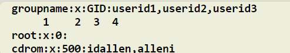
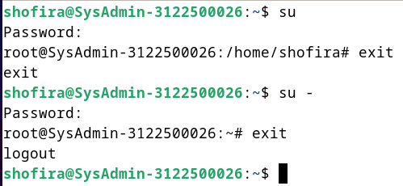
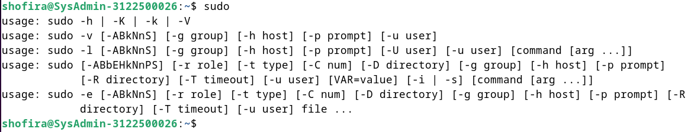
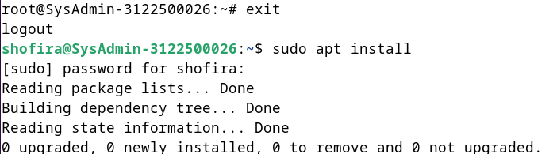
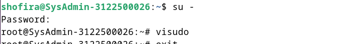
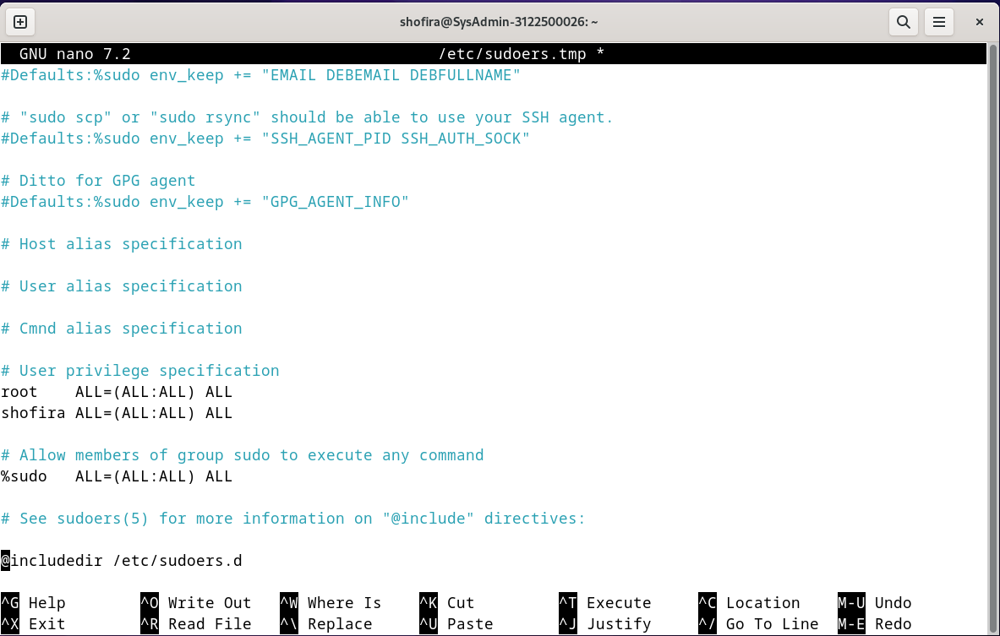

  <h1 align="Center">LAPORAN WORKSHOP ADMINISTRASI JARINGAN</h1>

  

<h4 align="Center">Anggota Kelompok 5</h4>

1. Arsyita Devanaya Arianto (3122500008)  
2. Mirta Chadhirotin Nachlah (3122500009)  
3. Shofira Izza Nurrohmah (3122500026)

 
<h4 align="center">
PROGRAM STUDI VOKASI  
D-III TEKNIK INFORMATIKA  
DEPARTEMEN TEKNIK INFORMATIKA DAN KOMPUTER 
POLITEKNIK ELEKTRONIKA NEGERI SURABAYA   
2023
</h4>   

1. Buatlah tulisan tentang langkah-langkah instalasi sistem operasi Debian. Anda bisa menggunakan aplikasi virtualisasi seperti VirtualBox, VMWare Player, Vmware Fusion (MAC), dls. Kebutuhan sistem adalah sebagai berikut :
   - CPU : 2 core 
   - RAM : 4096 (min)
   - HDD : 25 GB dengan partisi :
      * / : 20 GB
      * /storage : 5 GB 
      * / swap : 1,5 GB
   - Hostname : SysAdmin-NRP  

    Jawab : 
     - Langkah 1: Kunjungi situs resmi Debian untuk mengunduh file ISO terbaru: https://www.debian.org/distrib/ 
      
     - Langkah 2: Buka Aplikasi Virtual Box, kemudian klik add untuk menambahkan instalasi sistem operasi debian.  
       <space> 

     - Langkah 3: Isi nama untuk sistem operasi yang digunakan, kemudian pilih folder debian, dan pilih file ISO Image debian dengan type Linux, Versi Debian (64-bit). Lalu klik centang untuk melewati instalasi tanpa pengawasan.  
        <space> 
  
     - Langkah 4: Untuk username gunakan nama bebas, dan isi juga passwordnya. Sedangkan hostname gunakan dengan format SysAdmin-NRP  
        <space> 

     - Langkah 5: Isi kebutuhan sistem sebagai berikut :   ● CPU : 2 core   ● RAM : 4096 (min) 
      
        <space> 
  
     - Langkah 6: Pilih varian VDI (Virtual Disk Image) untuk Hardisknya 
       
        <space> 

     - Langkah 7: Setelah itu, pilih installer menu yaitu graphical install
       
        <space> 

     - Langkah 8: Kemudian pilih bahasa indonesia
       
        <space> 

     - Langkah 9: Pilih peta tombol yang digunakan
       
        <space> 

     - Langkah 10: Atur nama host untuk sistem ini, dengan format : SysAdmin-NRP
       
        <space> 

     - Langkah 11: Untuk domain bisa dilewati saja/diisi terserah
       
        <space> 
     
     - Langkah 12: Atur password/kata sandi untuk root
       
        <space> 

     - Langkah 13: Isi nama lengkap dari pengguna
       
        <space> 

     - Langkah 14: Atur nama pengguna nya
       
        <space> 

     - Langkah 15: Atur kata sandi untuk pengguna. Kata sandi pengguna harus berbeda dengan kata sandi root
       
        <space> 

     - Langkah 16: Atur lah zona waktu yang digunakan
       
        <space> 

     - Langkah 17: Untuk pilihan partisipasi hardisk pilih yang manual
       
        <space> 

     - Langkah 18: Pilih partisi untuk mengubah susunannya
       
        <space> 

     - Langkah 19: Pilih “Ya” untuk partisi seluruh hard disk
       
        <space> 

     - Langkah 20: Pilih ruang kosong untuk membuat sebuah partisi baru
       
        <space> 
        <space> 

     - Langkah 21: Atur ukuran partisi yang tidak melebihi batas maksimum yaitu 20.0 GB
      
        <space> 

     - Langkah 22: Pilih primer untuk jenis partisi
       
        <space> 

     - Langkah 23: Atur lokasi partisi baru di awal ruang hard disk yang tersedia
       
        <space> 

     - Langkah 24: Ubah susunan partisi penanda bisa-boot dari mati menjadi hidup
       
        <space> 
        <space> 

     - Langkah 25: Atur partisi yang digunakan yaitu sistem berkas berjurnal Ext4
       
        <space> 

     - Langkah 26: Penyusunan partisi \#1 telah diselesaikan, kemudian klik lanjutkan
       
        <space> 

     - Langkah 27: Pilih ruang kosong untuk membuat sebuah partisi baru (partisi \#2)
       
        <space> 
        <space> 

     - Langkah 28: Atur ukuran partisi yang tidak melebihi batas maksimum yaitu 5.0 GB
       
        <space> 

     - Langkah 29: Pilih jenis partisi “Primer”
       
        <space> 

     - Lngkah 30: Atur lokasi partisi baru di awal ruang hard disk yang tersedia
       
        <space> 

     - Langkah 31: Ubah susunan partisi titik kait
       
        <space> 
     - Langkah 32:  Pilih “Masukkan secara manual”  
       <space> 
     - Langkah 33:   Ketikkan “/storage”  
       <space> 
     - Langkah 34:  Penyusunan partisi \#2 telah diselesaikan, kemudian klik lanjutkan  
       <space> 
     - Langkah 35: Pilih ruang kosong untuk membuat sebuah partisi baru (partisi \#3)  
       <space> 
       <space> 
     - Langkah 36: Atur ukuran partisi yang tidak melebihi batas maksimum yaitu 1.5 GB  
       <space> 
     - Langkah 37: Pilih jenis partisi “Primer” 
       <space> 
     - Langkah 38: Atur lokasi partisi baru di awal ruang hard disk yang tersedia 
       <space> 
     - Langkah 39: Ubah penggunaan partisi menjadi ruang swap  
       <space>  
     - Langkah 40: Penyusunan partisi \#3 telah diselesaikan, kemudian klik lanjutkan.  
       <space> 
     - Langkah 41: Partisi telah selesai, kemudian klik “lanjutkan”
      
       <space> 
     - Langkah 42: Pilih “Ya” untuk melanjutkan perubahan-perubahan sebelumnya ditulis ke hard disk  
       <space> 
     - Langkah 43: Pemasangan sistem dasar berjalan, lalu pilih “Tidak” dan klik “Lanjutkan”  
       <space>  
     - Langkah 44: Atur negara tempat cermin arsip debian berada di Indonesia  
       <space> 
     - Langkah 45: Atur cermin arsip debian deb.debian.org  
       <space> 
     - Langkah 46: Kosongi alamat proxy HTTP  
       <space> 
     - Langkah 47: Tunggu loading selesai untuk mengatur pengelolaan paket  
       <space> 
     - Langkah 48: Pilih tidak untuk partisipasi survey pengguna paket debian  
       <space> 
     - Langkah 49: Perangkat yang ingin diinstal adalah debian desktop environment, …GNOME, perkakas sistem standar  
       <space> 
     - Langkah 50: Kemudian tunggu untuk memilih & memasang perangkat lunak  
       <space> 
     - Langkah 51: Pilih Ya untuk pasang boot loader GRUB hard disk utama  
       <space> 
     - Langkah 52: Pilih piranti untuk pemasangan boot loader  
       <space> 
     - Langkah 53: Tunggu proses instalasi selesai  
       <space> 
     - Langkah 54: Klik lanjutkan untuk menyelesaikan instalasi  
       <space> 
     - Langkah 55: Tunggu proses instalasi untuk menjalankan sistem yang baru   
       <space> 
     - Langkah 56: Berikut adalah tampilan untuk login user  
       <space> 
     - Langkah 57: Masukkan kata sandi yang sesuai untuk user  
       <space> 
     - Langkah 58: Kemudian pilih bahasa indonesia   
       <space> 
     - Langkah 59: Pilih tata letak papan bahasa indonesia   
       <space> 
     - Langkah 60: Untuk layanan lokasi diaktifkan agar bersifat privasi    
       <space> 
     - Langkah 61: Debian GNU?Linux sudah selesai dan siap untuk digunakan     
       <space> 
     - Langkah 62: Ketik pada kolom pencarian "diskart" untuk melihat storage hardisk     
       <space> 
     - Langkah 63: Menampilkan volume hardisk.   
       <space> 

2. Buat ringkasan tentang perbedaan dari Debian 12 (bookworm) dengan Debian 11 (bullseye) : versi kernel, kebutuhan sistem, penerapan systemd dan perbedaan packagenya (dalam bentuk tabel) ! 
   
    Jawab : 
        <table>
          <thead>
            <tr>
              <th>Perbedaan</th>
              <th>Debian 12 (bookworm)</th>
              <th>Debian 11 (bullseye)</th>
            </tr>
          </thead>
          <tbody>
            <tr>
              <td>Versi Kernel</td>
              <td>Debian 12 menggunakan Versi Kernel lebih baru yaitu Kernel 6.1 yang menyediakan dukungan untuk perangkat keras terbaru & perbaikan keamanan & kinerja.</td>
              <td>Debian 11 menggunakan Versi kernel lebih lama yaitu kernel versi 5.10 yang stabil dan memiliki dukungan yang baik.
              </td>
            </tr>
            <tr>
              <td>Kebutuhan Sistem</td>
              <td>
                Memiliki kebutuhan sistem lebih tinggi.  
                <ol>
                  <li>
                    Processor: Debian 12 mendukung berbagai arsitektur yaitu :
                    <ul>
                      <li>64-bit PC (amd64)</li>
                      <li>64-bit ARM (AArch64)</li>
                      <li>EABI ARM (armel)</li>
                      <li>Hard Float ABI ARM (armhf)</li>
                      <li>32-bit PC (i386)</li>
                      <li>MIPS (little endian)</li>
                      <li>64-bit MIPS (little endian)</li>
                      <li>POWER Processors</li>
                      <li>IBM System z</li>
                    </ul>
                  </li>
                  <li>
                    RAM: Minimal 1 GB, disarankan 2 GB untuk pengalaman yang optimal.
                  </li>
                  <li>
                    Penyimpanan: Setidaknya 10 GB untuk instalasi, disarankan 20 GB atau lebih. 
                  </li>
                  <li>
                    Grafis: Kompatibel dengan kartu grafis terintegrasi dan terdedikasi.
                  </li>
                  <li>
                    Koneksi Jaringan : Mendukung ethernet, Bluetooth, dan WiFi.
                  </li>
                </ol>
              </td>
              <td>
                Kebutuhan sistem lebih rendah.  
                  <ol>
                    <li>
                      Processor: Dukungan untuk arsitektur yang sama seperti Debian 12. 
                      <ul>
                        <li>64-bit PC (amd64)</li>
                        <li>64-bit ARM (AArch64)</li>
                        <li>EABI ARM (armel)</li>
                        <li>Hard Float ABI ARM (armhf)</li>
                        <li>32-bit PC (i386)</li>
                        <li>MIPS (little endian)</li>
                        <li>64-bit MIPS (little endian)</li>
                        <li>POWER Processors</li>
                        <li>IBM System z</li>
                      </ul>
                    </li>
                    <li>
                      RAM: Minimal 1 GB, disarankan 2 GB.
                    </li>
                    <li>
                      Penyimpanan: Setidaknya 10 GB untuk instalasi.
                    </li>
                    <li>
                      Grafis: Kompatibel dengan kartu grafis terintegrasi dan terdedikasi.
                    </li>
                    <li>
                      Koneksi Jaringan : Mendukung ethernet. Bluetooth, dan WiFi
                    </li>
                  </ol>
              </td>
            </tr>
            <tr>
              <td>Penerapan System</td>
              <td>
                Versi systemd lebih baru dengan peningkatan fitur dan perbaikan bug. (Versi 252)
              </td>
              <td>
                Versi systemd sebelumnya dengan pembaruan dan perbaikan bug (Versi 247)
              </td>
            </tr>
            <tr>
              <td>Package</td>
              <td>
                Peningkatan paket-paket perangkat lunak dengan versi yang lebih baru dan perbaikan keamanan
              </td>
              <td>
                Paket-paket yang lebih lama dengan pembaruan dan peningkatan keamanan
              </td>
            </tr>
          </tbody>
        </table>  
        Penjelasan lanjut perbedaan package :   
        <table>
          <thead>
            <tr>
              <th>Package</th>
              <th>Debian 12 (bookworm)</th>
              <th>Debian 11 (bullseye)</th>
            </tr>
          </thead>
          <tbody>
            <tr>
              <td>Apache</td>
              <td>2.4.54</td>
              <td>2.4.57</td>
            </tr>
            <tr>
              <td>Bash</td>
              <td>5.1</td>
              <td>5.2.15</td>
            </tr>
            <tr>
              <td>BIND DNS Server</td>
              <td>9.16</td>
              <td>9.18</td>
            </tr>
            <tr>
              <td>Cryptsetup</td>
              <td>2.3</td>
              <td>2.6</td>
            </tr>
            <tr>
              <td>Emacs</td>
              <td>27.1</td>
              <td>28.2</td>
            </tr>
            <tr>
              <td>Exim default e-mail server</td>
              <td>4.94</td>
              <td>4.96</td>
            </tr>
            <tr>
              <td>GNU Compiler Collection as default compiler</td>
              <td>10.2</td>
              <td>12.2</td>
            </tr>
            <tr>
              <td>GIMP</td>
              <td>2.10.22</td>
              <td>2.10.34</td>
            </tr>
            <tr>
              <td>GnuPG</td>
              <td>2.2.27</td>
              <td>2.2.40</td>
            </tr>
            <tr>
              <td>Inkscape</td>
              <td>1.0.2</td>
              <td>1.2.2</td>
            </tr>
            <tr>
              <td>the GNU C library</td>
              <td>2.31</td>
              <td>2.36</td>
            </tr>
            <tr>
              <td>Linux kernel image</td>
              <td>5.10 series</td>
              <td>6.1 series</td>
            </tr>
            <tr>
              <td>LLVM/Clang toolchain</td>
              <td>9.0.1 and 11.0.1 (default) and 13.0.1</td>
              <td>13.0.1 and 14.0 (default) and 15.0.6</td>
            </tr>
            <td>MriaDB</td>
              <td>10.5</td>
              <td>10.11</td>
            </tr>
            <tr>
              <td>Nginx</td>
              <td>1.18</td>
              <td>1.22</td>
            </tr>
            <tr>
              <td>OpenJDK</td>
              <td>11</td>
              <td>17</td>
            </tr>
            <tr>
              <td>OpenLDAP</td>
              <td>2.4.57</td>
              <td>2.5.13</td>
            </tr>
            <tr>
              <td>OpenSSH</td>
              <td>8.4p1</td>
              <td>9.2p1</td>
            </tr>
            <tr>
              <td>OpenSSL</td>
              <td>1.1.1n</td>
              <td>3.0.8</td>
            </tr>
            <tr>
              <td>Perl</td>
              <td>5.32</td>
              <td>5.36</td>
            </tr>
            <tr>
              <td>PHP</td>
              <td>7.4</td>
              <td>8.2</td>
            </tr>
            <tr>
              <td>Postfix MTA</td>
              <td>3.5</td>
              <td>3.7</td>
            </tr>
            <tr>
              <td>PostgreSQL</td>
              <td>13</td>
              <td>15</td>
            </tr>
            <tr>
              <td>Python 3</td>
              <td>3.9.2</td>
              <td>3.11.2</td>
            </tr>
            <tr>
              <td>Rustc</td>
              <td>1.48</td>
              <td>1.63</td>
            </tr>
            <tr>
              <td>Samba</td>
              <td>4.13</td>
              <td>4.17</td>
            </tr>
            <tr>
              <td>Systemd</td>
              <td>247</td>
              <td>252</td>
            </tr>
            <tr>
              <td>Vim</td>
              <td>8.2</td>
              <td>9.0</td>
            </tr>
          </tbody>
        </table>

3. Jelaskan fungsi dari file "/etc/groups" beserta formatnya!   
Jawab :
   - Fungsi :  File "/etc/group" digunakan untuk menyimpan informasi tentang grup-grup pengguna di sistem, termasuk nama grup, ID grup, dan anggota-anggota grup.Berikut adalah ringkasan fungsi dari /etc/group sesuai dengan poin-poin yang disebutkan:
      * Grup dan Izin: Grup memungkinkan serangkaian izin untuk ditetapkan, dan setiap objek sistem file memiliki izin "grup". Jika Anda bukan pemilik objek tetapi berada dalam grup tersebut, izin grup berlaku untuk Anda.
      * Manajemen Grup: Setiap objek sistem file hanya memiliki satu pemilik dan hanya dapat berada dalam satu grup. Pengguna yang login dapat menjadi anggota beberapa grup.
      * Penyimpanan Informasi Grup: Sebagian besar informasi grup, termasuk nama grup, ID grup, dan anggota grup, dikelola di file "/etc/group". 
      * GID Grup Awal: Saat pengguna login, mereka diberikan GID grup awal dari file "/etc/passwd". 
      * Grup Tambahan: Pengguna akan menjadi bagian dari grup lain (grup tambahan) jika mereka adalah anggota grup tersebut dalam file "/etc/group".  
  
      Jadi, "/etc/group" memainkan peran penting dalam manajemen grup pengguna di sistem Linux, dan berfungsi sebagai penyimpan informasi utama tentang grup-grup pengguna.
   - Format :  
    <space>   
      Keterangan: 
      1) Nama grup 
      2) Kata sandi terenkripsi (atau penanda x yang menunjukkan penggunaan /etc/gshadow)
      3) Nomor ID grup (GID) 
      4) Daftar opsional userid yang menjadi anggota grup itu Penjelasan: 1) Informasi tentang grup di atas disimpan di /etc/group 2) Modifikasi dapat dilakukan oleh root atau oleh Administrator Grup untuk suatu grup 3) Kontennya dapat dilihat oleh siapa saja 4) Kata sandi terenkripsi biasanya disimpan di /etc/gshadow, hanya dapat diakses melalui root 
    - Group commands : 
      1) groupadd - Buat grup baru di /etc/group 
      2) groupdel - Hapus grup dari /etc/group 
      3) groupmod - Ubah nama atau GID grup di /etc/group
      4) gpasswd - Mengelola file /etc/group dan /etc/gshadow 
        a. dapat digunakan oleh Administrator Grup serta root b. Menambahkan dan menghapus anggota grup, atau mengatur daftar anggota c. root dapat mengatur daftar Administrator Grup untuk suatu grup 
      5) group - Daftar semua grup tempat pengguna berada 
      6) id - Versi "grup" yang lebih rinci menunjukkan nilai-nilai numerik 
      7) newgrp - (jarang digunakan) gunakan kata sandi grup untuk memulai shell baru dengan hak grup tambahan 

4. Jelaskan perbedaan penggunaan perintah "su" dengan "su -"! Jawab :  
    Jawab :
     
        <space>  
      Perintah su dan su - adalah dua metode yang berbeda untuk beralih ke akun pengguna lain di sistem Linux. Dengan menggunakan perintah su tanpa argumen -, pengguna dapat beralih ke akun pengguna lain sambil mempertahankan variabel lingkungan milik pengguna asli. Namun, saat menggunakan perintah su -, selain beralih ke akun pengguna lain, variabel lingkungan dari pengguna asli akan dihapus dan lingkungan akan diatur ulang sesuai dengan akun pengguna yang dituju. Berikut ini perbandingan lebih detail antara su dan su -:
      <ul>
        <li>
          Perinah su:   Dengan menjalankan perintah su, akun pengguna dapat ditransfer ke akun pengguna lain yang kita tentukan, dan jika tidak menentukan akun pengguna, akun kita akan memasukkan akun pengguna Root secara default, sedangkan lingkungan pengguna kita saat ini, variabel lingkungan, dan skrip profil akan dilestarikan. Dengan menjalankan perintah su, akun kita beralih ke akun pengguna lain tanpa menjalankan shell login, dan variabel lingkungan yang ditetapkan untuk akun pengguna atau direktori kerja kita saat ini tetap tidak berubah.
        </li>
        <li>
          Perintah su -:   Jika Anda ingin mengubah lingkungan pengguna selain beralih ke akun pengguna lain, perintah su – akan membantu. Jika Anda menggunakan perintah su – untuk beralih ke akun pengguna yang Anda inginkan, nilai variabel lingkungan dan direktori akun pengguna yang Anda inginkan akan menggantikan nilai yang terkait dengan lingkungan kerja Anda saat ini, dan semua variabel lingkungan milik pengguna utama akan dihapus. 
        </li>
      </ul> 
      
      Perbedaan antara su dan su – memiliki dampak penting pada perubahan lingkungan dan variabel lingkungan di Linux saat berpindah antar akun pengguna. Singkatnya, perintah su memungkinkan kita mempertahankan lingkungan pengguna saat ini ketika beralih ke akun pengguna lain. Sebaliknya, perintah su – mengeksekusi shell login untuk mentransfer ke akun pengguna tertentu dan umumnya mengubah variabel lingkungan dan direktori kerja yang diatur di lingkungan pengguna.

5. Jelaskan fungsi dari "sudo" !  
Jawab :  
<space>   
Sudo merupakan singkatan dari Super User DO (user biasa dapat bertindak sebagai super user). Sudo merupakan program yang
terdapat dalam linux yang digunakan untuk menjalankan perintah yang membutuhkan akses dari akun root. Sudo hanya dapat digunakan oleh user yang sudah tercantum pada file /etc/sudoers.Tujuan awal dari pembuatan sudo adalah untuk mengurangi resiko berbahaya yang mungkin akan terjadi jika terlalu sering menggunakan root. Oleh karena itu, program sudo dibuat untuk memungkinkan user biasa dapat menjalankan perintah yang membutuhkan akses dari root tanpa harus login dengan menggunakan
root.Pada saat dijalankan sudo akan meminta password user yang menjalankan sudo tersebut, tetapi bisa juga dibuat untuk meminta password root atau tanpa password sama sekali. Secara default password yang dimasukkan tadi akan disimpan selama 15 menit, dan 15 menit kedepan user akan diminta memasukan password lagi. 

6. Jelaskan langkah-langkah penambahan user anda sebagai user sudo ! Gunakan perintah "su -" lalu setelah masuk sebagai root, jalankan perintah "visudo". Tambahkan user anda di bawah user root pada bagian " \# User privilege specification"  
Jawab :  
  <space>   
  Langkah-langkah untuk menambahkan pengguna sebagai pengguna sudo menggunakan perintah su - dan visudo adalah sebagai berikut:  
  - Menjalankan perintah su - untuk masuk sebagai root dan akan diminta untuk memasukkan kata sandi root. 
  - Setelah berhasil masuk sebagai root, jalankan perintah `visudo` untuk mengedit file konfigurasi sudoers.  
  <space>   
  - Pada editor teks, cari bagian yang berjudul "# User privilege specification". Biasanya bagian ini terletak di bagian paling bawah file. 
  - Di bawah baris yang menyatakan hak akses untuk pengguna root, tambahkan baris baru untuk menambahkan pengguna sebagai pengguna sudo.  
  <space>   
  Penjelasan format baris di atas yaitu:
    - Semua baris yang dimulai dengan # adalah komentar (comment)
    - Root ALL=(ALL:ALL) ALL – baris ini berarti user root mempunyai hak-hak istimewa yang tidak terbatas dan dapat menjalankan semua command pada sistem.
    - shofira ALL=(ALL:ALL) ALL – baris ini berarti user shofira mempunyai hak-hak istimewa yang tidak terbatas dan dapat menjalankan semua command pada sistem.
    - %sudo ALL=(ALL:ALL) ALL – semua user di dalam grup sudo mendapatkan hak-hak istimewa untuk menjalankan command apa saja
  - Setelah menambahkan baris untuk pengguna baru, simpan perubahan tersebut dan keluar dari editor. Dengan menekan tombol "Ctrl + X", lalu tekan "Y" untuk menyimpan perubahan, dan terakhir tekan `Enter` untuk keluar dari editor.
  - Setelah langkah-langkah ini selesai, pengguna baru sudah memiliki akses sudo.
  - Dengan visudo, dapat mengedit file konfigurasi sudoers dengan benar dan menghindari kemungkinan terkunci akibat kesalahan format yang mungkin terjadi jika mengedit file tersebut langsung.

